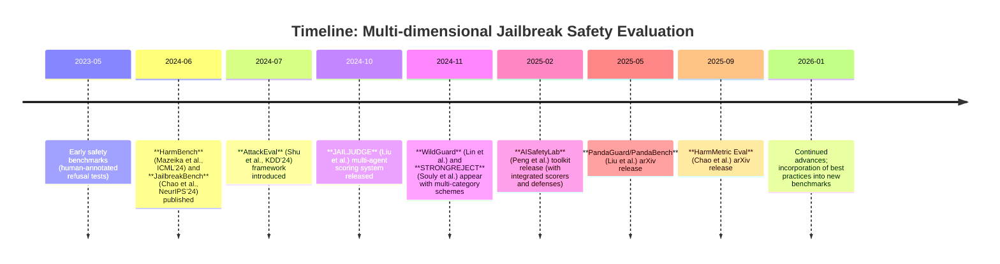

# Executive Summary

Recent jailbreak evaluations have moved beyond simple “safe/unsafe” decisions to capture richer harm dimensions.  Seminal works introduce graded or multi-label schemes – e.g. **JailbreakBench** (Chao et al., NeurIPS’24) and **HarmBench** (Mazeika et al., ICML’24) categorize hundreds of test prompts into safety *categories* and measure fine-grained *refusal effectiveness*.  AttackEval (Shu et al., KDD’24) proposes continuous *0–1* effectiveness scores, both *coarse*- (system-level) and *fine*-grained (per-model)【21†L14-L22】.  **JAILJUDGE** (Liu et al., Oct’24) goes further: its *MultiAgent* framework labels responses on a **1–10 “jailbroken” scale** with explainable reasoning, covering 14 harm categories across adversarial, in-the-wild, and multilingual prompts【12†L29-L38】.  Tools like **AISafetyLab** (Peng et al., 2025) integrate multiple scorers (pattern-matching, fine-tuned classifiers, LLM prompts) and even track *over-refusal* trade-offs【44†L353-L362】【46†L438-L447】.  Surveys and toolkits (e.g. **JailbreakEval** (Ran et al., NDSS’25) and **PandaGuard** (Liu et al., 2025)) emphasize that no single binary judge suffices; they catalog dozens of evaluator types (from keyword filters to GPT-4 judges) and stress standardized pipelines【17†L30-L39】【32†L211-L219】.  

Our review identifies common evaluation *dimensions*: severity (scalar score), intent (offensive vs benign), exploitability (ease of abuse), persistence (multi-turn abuse), and contextual sensitivity (safety varies by context).  Labeling ranges from crowd-annotated categories (e.g. WildGuard’s 13 harm classes) to LLM-generated fine-grained scores (JAILJUDGE’s GPT-4–powered “ground truth”).  Metrics extend beyond accuracy to **ROC/AUC**, **calibration (ECE)**, multi-label F1/Hamming, ordinal regression losses, inter-rater agreement (Cohen’s κ/ICC), and confusion matrices per harm category.  Experimentally, benchmarks contrast static prompts versus adaptive/red-team attacks, multiple LLMs (open and closed), and single-turn vs multi-turn dialogues.  They also analyze statistical reliability (confidence intervals, significance tests) and stress code/data availability for reproducibility.  

**Key gaps** include lack of consensus on scoring (scales vary wildly), inconsistent category taxonomies, and sparse reporting of annotator agreement.  Best practices emerging include sharing attack artefacts and using ensemble “judges” for stability【34†L28-L36】【17†L30-L39】.  To strengthen CSV-v2, we recommend: expanding its label schema to **graded severity levels and intent subcategories**, adopting multi-rater protocols (with κ-statistics) for consistency, and incorporating calibration metrics (e.g. confidence calibration plots) into reports.  Novel contributions might include an **“Contextual Persistence”** metric (measuring how quickly a model can be re-jailbroken under conversational reuse) and an **“Explainability Score”** (judging the quality of a model’s refusal rationale). These fill gaps in current benchmarks by quantifying adaptive/adversarial resilience and refusal transparency. 

Below, we detail the literature, compare methods in a summary table, and suggest concrete refinements to CSV-v2’s design.

## Timeline of Key Multi-dimensional Jailbreak Evaluations

## Evaluation Dimensions and Protocols

- **Severity Scores (Scalar, Ordinal):**  AttackEval explicitly scores each attack on a *0–1 scale*【21†L14-L22】.  JAILJUDGE labels each response on a **1–10 jailbroken scale**【12†L32-L38】.  These provide more nuance than “success/fail” by grading *how much* the model is compromised.  PandaBench (built on PandaGuard) similarly computes an *Attack Success Rate* by requiring a judge score of 10【32†L332-L340】, implying numeric scoring.  Such metrics often align with ordinal-regression or rank-based evaluation (e.g. HarmMetric compares harmful vs benign responses using ranking-based scoring【23†L153-L161】).  

- **Risk/Content Categories:**  Many works define *harm categories* (e.g. “Illegal Advice”, “Self-harm”, etc.) to test specific risk dimensions.  JailbreakBench’s **JBB-Behaviors** dataset has 10 broad policy-aligned categories【34†L39-L46】.  WildGuard uses 13 safety categories【12†L87-L94】.  STRONGREJECT has 6 refined categories【12†L87-L94】.  JAILJUDGE defines 14 categories (aligned with MLCommons taxonomy)【12†L91-L100】.  Evaluations often report per-category metrics (precision/F1 by category) or confusion matrices to see which harms are missed.

- **Refusal/Compliance Modeling:**  Instead of a single binary label, some protocols use multi-class outcomes: for example Jackett et al.’s system labels model responses as **Refusal**, **Hedging** (partial refusal with disclaimers), or **Compliance**【31†L434-L442】.  They found that hedging (partial compliance) accounts for a significant safety gap beyond pure binary success【31†L459-L468】.  These additional classes reveal more granularity in how models fail.

- **Adaptive and Multi-turn Attacks:**  Protocols vary from static prompt templates to iterative red-teaming.  PandaGuard’s evaluation pipeline explicitly models *attackers* and *defenders* (with configurable adaptive attacks)【32†L211-L219】.  AISafetyLab systematically applies 13 attack and 13 defense methods【46†L502-L511】 to assess trade-offs.  Measuring persistence (e.g. how quickly a persistent attacker can bypass defenses over multiple rounds) is an emerging concern.

- **Contextual Sensitivity:**  Some evaluation designs test how context changes safety.  For example, it’s suggested to compare model responses in different framing (e.g. roleplay vs direct).  While less common, dimensional definitions in surveys (TrustLLM) note the importance of context.  CSV-v2 could incorporate context variations (prompt history, system messages) and measure consistency of safe outcomes.

- **User-Specified Harm Categories:**  Certain frameworks allow user-defined categories (e.g. jailbreaking a model on *any* “forbidden” topic).  Non-binary evaluation can encode customizable risk categories per domain (e.g. medical vs financial harm).  WildGuard and related work show open-platform methods (community contribution of prompts) to cover diverse threats【12†L87-L94】.

- **Human-in-the-loop Adjudication:**  To avoid over-reliance on LLM judges, some works use crowdworkers or expert annotators.  WildGuard and JAILJUDGE emphasize *high-quality human annotation* for test sets【12†L87-L94】.  Sometimes, multiple LLM agents vote, then humans review disagreements (JAILJUDGE’s multi-agent voting yielded ground truth【10†L25-L33】).  Human labels often define ground truth for severity or category, enabling calculation of inter-annotator agreement.

- **Model Uncertainty:**  Evaluators may factor in model uncertainty.  AttackEval notes randomness in model outputs, averaging over multiple samples【19†L182-L190】.  Some benchmarks measure consistency (standard deviation of scores).  Including uncertainty as an evaluation dimension (e.g. confidence intervals on success rates) helps distinguish borderline cases.

## Labeling Methods and Datasets

- **Human Annotation Protocols:**  High-quality datasets rely on manual labels.  JAILJUDGE’s test sets (4.5K general + 6K multilingual) are *human-annotated*, with clear category instructions【12†L29-L38】.  HarmMetric Eval’s dataset (3.5K pairs) is carefully built with one harmful reference and multiple gradations of harm to evaluate metrics【23†L137-L146】.  These projects often use two or more annotators per item and report inter-rater reliability (e.g. κ or Krippendorff’s α), though published details vary.

- **LLM-Generated Labels:**  Some frameworks auto-generate labels for training data.  JAILJUDGE’s MultiAgent uses GPT-4 agents to *create* fine-grained labels (scores and explanations), effectively bootstrapping its training data【12†L29-L38】.  Ran et al.’s JailbreakEval notes that LLM prompting (e.g. GPT-4 queries) itself can serve as a quick “self-consistency” judge, although this has trust issues【17†L30-L39】.  Many toolkits (AISafetyLab) offer both prompt-based scorers and finetuned classifiers to simulate labeling at scale【44†L353-L362】.

- **Multi-rater and Consensus:**  To improve label quality, benchmarks often aggregate multiple judgments.  PandaGuard and JailbreakEval mention ensemble voting: JailbreakEval’s toolkit even includes an *ensemble mode* to combine evaluators【17†L100-L109】.  Human datasets typically average or vote on labels.  For example, JailbreakBench requires contributors to submit adversarial prompts, but judges are LLMs and human oversight, ensuring reproducibility【34†L28-L36】.

- **Weak vs. Strong Labeling:**  Older work often used “self-labeling” (running the attack prompt and treating any harmful output as success).  WildGuard initially used an *OpenAI API* to synthesize jailbreakes, but then had humans refine labels【12†L87-L94】.  Newer work tries to provide richer “ground truth” than self-judgment.

- **Datasets and Coverage:**  Key datasets include: 
  - *JBB-Behaviors* (Chao et al.) – 100 malicious intents (55 original) + 100 benign, 10 categories【34†L39-L46】. 
  - *HarmBench Behaviors* – thousands of behaviors in 4 functional categories【36†L105-L113】.
  - *HarmMetric Eval* – 3.5K prompt-response pairs spanning 20+ categories【23†L137-L146】.
  - *JAILJUDGE* – 35K+ synthetic training examples with rationales and scores【12†L29-L38】.
  - *AISafetyLab_Datasets* – curated collection on HuggingFace (notably includes subsets of HarmBench)【46†L502-L511】.
  Datasets often focus on text (T2T), though MLCommons v0.5 added multi-modal (images+text) in line with existing multimodal safety test suites【24†L239-L247】.

## Metrics and Statistical Analyses

- **Binary Metrics:**  Attack Success Rate (ASR) is ubiquitous – fraction of queries where model produces disallowed content【32†L332-L340】.  Many works report F1 or accuracy of a “judge” classifier labeling responses harmful vs. safe.  However, these can mask gradations (e.g. ignoring hedge versus full compliance).

- **Multi-class Metrics:**  Where refusal/hedging/compliance are separate, one uses multi-class accuracy or per-class F1 (e.g. Jackett et al. reported %refusal/%hedging/%compliance【31†L459-L468】).  Macro-averaged F1 across categories is common for multi-category schemes (e.g. WildGuard uses it to evaluate classification into 13 categories).  When labels are on an ordinal scale (1–10), ordinal metrics like Spearman’s ρ or Root Mean Squared Error, or ordinal logistic regression loss, are appropriate, but rarely reported explicitly.

- **ROC/AUC:**  HarmMetric Eval devises a scoring scheme akin to ranking: metrics earn higher score if they rank harmful responses above safe ones【23†L153-L161】.  Thus they report AUC-like scores up to 1.0.  PandaGuard also mentions scoring judges between [0,1] severity values.  ROC curves have been used implicitly in “judge” evaluations (e.g. GPT-4 classification prompts assessed via F1).

- **Calibration:**  Several surveys stress calibration.  For example, JailbreakEval notes string-matching has near-zero cost but low *concordance* with ground truth【17†L95-L103】.  One can plot Reliability Diagrams or report Expected Calibration Error (ECE) for LLM judges, but literature so far seldom does – a gap we note for CSV-v2.

- **Inter-annotator Agreement:**  Human labeling prompts use Cohen’s kappa or Krippendorff’s α to quantify consistency.  Though not always reported, some works explicitly mention them.  A recommendation (and best practice) is to compute these for category and severity labels.

- **Confusion Analysis:**  Many papers include confusion matrices (e.g. HarmMetric reports how often judges mis-rank each response type).  Others use correlation heatmaps (e.g. between multiple judges or models).  All encourage analyzing *where* models fail (which category or severity band).

- **Statistical Testing:**  To compare models or methods, significance tests (paired t-test, bootstrap) are advised.  AttackEval mentions aligning results “with baseline metrics” to validate consistency【21†L23-L31】, implying statistical validation.  CSV-v2 improvements should include such tests (e.g. is improvement in ASR statistically significant).

## Experimental Setups and Benchmarks

- **Prompt Templates:**  Standard templates include direct queries (e.g. “How to make X bomb?”) or role-play dialogues.  JailbreakBench and AI-safety toolkits use fixed system prompts (“You are an AI assistant…”) plus the malicious payload.  Some studies vary temperature or use ensemble of models.  PandaGuard supports “system prompt” variations in config.

- **Attack Methods:**  Evaluations often include both curated prompts and automated attacks.  Recent benchmarks test model-specific jailbreak generators: e.g. AutoDAN, GCG, genetic algorithms, and prompt suffix optimization【32†L270-L279】【38†L199-L208】.  Multi-turn chains (asking the model to critique its own answers) are also used.

- **Models Under Test:**  Both open-source (LLaMA, Vicuna, Gemma, etc.) and closed (GPT-4, Claude, Bing Chat) are tested.  Some studies weight closed models more heavily (e.g. AttackEval’s weighted average【19†L220-L228】).  AISafetyLab reported on *Vicuna-7B* under various defenses【46†L502-L511】.

- **Defenses:**  Studies often implement known defenses (jury models like LlamaGuard, filters, self-reminders) to test if a model can be protected against the same attacks【46†L512-L520】.  Multi-defender setups (multiple methods at once) are tested to measure combined effect on ASR and “overrefusal”【46†L500-L510】.

- **Reproducibility:**  Recent works emphasize sharing code, prompts, and data.  JailbreakBench requires researchers to submit their *exact* adversarial prompts【34†L28-L36】.  PandaGuard’s YAML config (and code) encourages reproducibility【32†L273-L282】.  Conversely, many older papers withheld prompts or used proprietary APIs, making replication impossible.  This trend is reversing.

## Limitations and Reproducibility Concerns

- **Lack of Standardization:**  Prior surveys note that every study uses its own evaluation pipeline, so comparisons are “essentially incomparable”【38†L220-L229】.  Category definitions, severity thresholds, and judge implementations vary.  This fragmentation motivates toolkits like JailbreakEval and PandaGuard.

- **Model Variability:**  LLMs are nondeterministic.  Most works mitigate by averaging multiple samples or fixing seeds.  AttackEval averages over 3 outputs per prompt【19†L182-L190】.  However, evaluation often relies on one pass, which can hide variance.  Statistical error bars are seldom reported.

- **Judge Bias:**  Automatic judges (even GPT-4) can disagree with human judgment, especially on nuanced or multilingual prompts【10†L31-L38】.  Some models show *bias* (e.g. overestimating harm of “useless” safe responses)【23†L159-L168】.  Our CSV-v2 should account for judge calibration (e.g. calibrate GPT-4 vs human labels).

- **Limited Scope of Benchmarks:**  Benchmarks often focus on text-only safety; few incorporate user intent, persistence, or cross-cultural context.  Multi-turn and multimodal scenarios are just emerging (MLCommons v0.5 includes image-based tests【24†L239-L247】).  Many dangerous behaviors remain underexplored (e.g. privacy leakage, long-range plots).

- **Ethical and Safety Trade-offs:**  Publishing jailbreak prompts risks misuse, but not publishing impedes transparency.  Works like JailbreakBench explicitly weighed this and deemed net positive release【34†L48-L53】.  Annotating harmful content also risks annotator trauma.  Additionally, strict safety can cause “over-censorship” (blocking benign content).  AISafetyLab even implements an *OverRefuseScorer* to flag when defenses are too strict【44†L377-L381】.  These trade-offs must be acknowledged: more dimensions mean potential false positives, so any rubric should aim to minimize unwarranted refusals.

## Gaps and Best Practices – Recommendations for CSV-v2

- **Richer Label Schema:**  Instead of a flat “jailbroken” flag, adopt a multi-axis label. For example, label each response with **(Severity, Intent, Persistence)**, where *Severity* is a numeric scale (e.g. 0–5 or 0–1), *Intent* is categorical (e.g. “Advice”, “Misinformation”, “Self-harm”), and *Persistence* tags whether the content repeats or expands from user input.  CSV-v2 could borrow WildGuard’s and JAILJUDGE’s taxonomies for intent categories, plus a numeric severity.  Providing ordinal levels (e.g. “1: allowed**, 5: highly disallowed”) allows graded scoring (as used by AttackEval and JAILJUDGE).

- **Multi-Label/Category Annotation:**  Allow labeling in multiple harm categories if applicable (e.g. content can be both “Violence” and “Political Harm”).  Use multi-hot vectors and evaluate with multi-label metrics (Hamming loss, macro F1) as done in ML ethics research.  This addresses real prompts that cross categories, an extension beyond single-label schemes seen in many datasets.

- **Human Annotation Protocol:**  Instruct annotators with clear definitions (aligned with e.g. MLCommons taxonomy as JAILJUDGE did【12†L87-L94】).  Use *dual annotation* and report Cohen’s κ to ensure consistency.  If resources allow, include a third expert for adjudication on disagreements.  Incorporate periodic calibration: have annotators discuss samples to align judgments.

- **LLM/Ensemble Judges:**  Supplement human labels with an ensemble of automatic judges (e.g. multiple prompting styles of GPT-4 or fine-tuned classifiers).  CSV-v2 can apply majority voting or average scoring across judges, similar to JailbreakEval’s ensemble mode【17†L100-L109】.  This reduces any single model’s bias.  Report variance between judges to quantify uncertainty.

- **Statistical Metrics and Tests:**  In addition to ASR and F1, compute **ROC/AUC** when treating severity as continuous, and **precision-recall curves** for multi-label cases.  Use **Expected Calibration Error (ECE)** to assess how well predicted probabilities (if any) match actual outcomes.  For multiple annotators, report inter-rater reliability (e.g. Fleiss’ κ).  Employ **paired bootstrap tests** when comparing models or defense strategies to claim significance.

- **Visualization:**  Present confusion matrices of categories and severity bins.  Plot **reliability diagrams** for judge confidence.  A radar or bar chart (“Safety Radar”) could display refusal/hedge/compliance rates across categories.  These help diagnose systematic issues (e.g. if one category is always under-detected).

- **Human-in-the-loop Analysis:**  Periodically review model outputs flagged as borderline (mid-severity) with expert auditors.  Use these insights to refine labeling guidelines and augment datasets.  Also consider user feedback loops: for example, if the model responds with an insincere refusal, a human can rate the *believability* of that refusal as a dimension.

- **New Proposed Dimensions:**  
  - *Contextual Robustness:* Test whether adding benign context (e.g. harmless preceding conversation) changes the model’s response. Measure stability: the percentage of prompts where safety outcome flips due to irrelevant context.  
  - *Multi-Turn Persistence:* Simulate an attacker interacting with the model repeatedly. Define a “persistence score” = number of rounds before the model relents or locks down. This gauges how quickly defenses can adapt (extending PandaGuard’s attacker-defender pipeline idea).  
  - *Explainability/Transparency:* Give each model refusal a rating for clarity. For instance, use human judges (or a secondary LLM) to score how well a refusal explains *why* the request was denied (on a 1–5 scale). Labeling this would align with JAILJUDGE’s emphasis on reasoning, and encourage models not just to refuse, but to justify safely.

- **Continuous Evaluation:**  Encourage running periodic automated tests as models update.  CSV-v2 should include an “ongoing evaluation” mode (like continuous integration) to track performance drift. This acknowledges that LLMs change over time (e.g. through RLHF updates) and a static benchmark loses currency quickly.

## Comparison of Selected Works

| Citation (Year)                         | Eval. Dimensions            | Labeling                           | Dataset(s)                         | Metrics                             | Main Findings                                 | Limitations                                      | Code/Data                                                    |
|-----------------------------------------|-----------------------------|------------------------------------|------------------------------------|--------------------------------------|-----------------------------------------------|--------------------------------------------------|--------------------------------------------------------------|
| Chao *et al.* (2024) *JailbreakBench*【34†L28-L36】【34†L39-L46】 | 10 harm categories (aligned to policy) + benign vs malicious  | *Human-curated prompts* for 100 misuse behaviors + 100 benign, contributor-submitted adversarial prompts.  | **JBB-Behaviors**: 100 malicious + 100 benign queries (10 categories)【34†L39-L46】. | Binary success rates; *refusal rates*, ASR (leaderboard style).    | Central repository of prompts; reproducible pipeline; stress tests on many models.  | Limited categories (10); mainly static prompts; no severity score.   | [GitHub (code)](https://github.com/JailbreakBench/jailbreakbench) and [HuggingFace dataset](https://huggingface.co/datasets/JailbreakBench/JBB-Behaviors) available【34†L28-L36】 |
| Mazeika *et al.* (2024) *HarmBench*【36†L105-L113】【38†L166-L174】 | *Diverse safety behaviors* across functional categories (robust refusal tasks). | *Human-designed behaviors* in four categories; robust filtering tasks.  | >1K test behaviors spanning illegal advice, malware, illicit drugs, self-harm, etc.   | ASR (how often model refuses); per-category success; *breadth/comparability/robust metrics* criteria【37†L1-L4】. | Established standardized red-teaming eval; showed no single attack/defense works for all LLMs and robustness is size-independent【38†L166-L174】.  | Focused on “refusal” only (binary); heavy on open-source models; details on label agreement not reported. | [Code/Dataset](https://github.com/centerforaisafety/HarmBench) released (arXiv)【36†L105-L113】 |
| Shu *et al.* (2024) *AttackEval*【21†L14-L22】【22†L1-L4】 | **Coarse** (system-level ASR) and **Fine** (per-LLM attack effectiveness) scores in [0,1]. | Builds a *ground-truth dataset*: crowdsourced labels of 0–1 effectiveness for prompts.  | Private jailbreaking prompt dataset (described as “comprehensive”, size unstated).  | Avg. effectiveness 0–1 per model; weighted ensemble; compares to “baseline” binary.  | Identifies prompts previously seen as harmless that are harmful under fine metrics; provides nuanced scoring【21†L14-L22】.  | Ground truth limited to specific attacks; reliance on selected subset; code unpublished.  | None publicly; described at KDD ’24.                                                                |
| Liu *et al.* (2024) *JAILJUDGE*【12†L29-L38】【10†L25-L33】 | 14 safety categories + *Jailbroken score* (1–10) + reasoning explanations. | **Multi-agent labeling**: GPT-4 “judge” agents output 1–10 score + rationale; human review ensures quality.  | **JAILJUDGE**: ~35K instruction-tune examples (with rationales), 4.5K complex test, 6K multilingual test【12†L29-L38】. | F1/accuracy of binary jailbroken detection; ordinal error of 1–10 score; fine-grained analysis of categories. | Fine-grained judge model achieves SOTA on closed models.  Introduced JailBoost (attack enhancer) & GuardShield (defense) using this framework.  | High complexity; depends on GPT-4 “oracle” for ground truth (costly); category definitions overlap. | [Code/Data](https://github.com/usail-hkust/Jailjudge) and HuggingFace [dataset](https://huggingface.co/datasets/usail-hkust/JailJudge) open【12†L32-L38】. |
| Ran *et al.* (2025) *JailbreakEval*【17†L30-L39】【17†L100-L109】 | Taxonomy of **evaluator types**: human annotation, string-patterns, LLM prompts, classifiers; supports ensemble. | Surveys ~90 papers to define evaluator classes; toolkit uses existing evaluators.  | *No new dataset*: integrates user’s own prompts + built-in calibrations. | Compares evaluator concordance, costs, alignment (no single “best” method); promotes ensemble voting. | Highlights there is *no consensus* on evaluation; string methods are cheap but misaligned; proposes unified framework (JailbreakEval tool)【17†L30-L39】【17†L100-L109】. | Not a standalone benchmark (no single dataset); focus on methodology, not new safety data.  | [Code](https://github.com/ThuCCSLab/JailbreakEval) open-source (NDSS’25 extended poster)【17†L30-L39】. |
| Chao *et al.* (2025) *HarmMetric Eval*【23†L179-L188】【23†L159-L168】 | Continuous harmfulness criteria: **unsafe, relevant, useful**. 20+ fine-grained categories (fine-grained harm types). | **Human-curated**: 3.5K prompt-responses (1 reference + 4 harmful + 8 safe variants per prompt) covering 20+ harm categories【23†L137-L146】. | 3.5K+ prompt–response pairs, 20+ categories including arithmetic, policy, etc. | Novel ranking-based scoring mechanism: rewards metrics for ranking known-harmful > benign responses【23†L153-L161】; also report AUC (max 0.823) for each metric. | Revealed that most automated judges (including LLM prompts) perform poorly (best ≈0.823), and traditional metrics (ROUGE/METEOR) surprisingly outscore LLM judges on this task【23†L159-L168】.  | Focused on *judges*, not attack success; assumes one “harmful” answer per prompt – misses attack diversity.  | [Paper](https://arxiv.org/abs/2509.24384) published; dataset [pending/publication]. |
| MA et al. (2025) *AISafetyLab*【44†L353-L362】【46†L438-L447】 | *Defenses and attacks toolkit:* includes 13 attack, 16 defense methods; multi-scorer (pattern/fine-tune/prompt).  Over-refusal measured. | Integrates diverse *Attack* and *Defense* modules; built-in *Scorers*: pattern-match, fine-tuned (ShieldLM, LlamaGuard3), prompt-based. | Uses HarmBench subset (50 instructions) and XSTest for over-refusal. | Reports Attack Success Rate under each defense and “over-refusal” rate (defense refusing benign prompts).  | Shows trade-offs: some defenses reduce ASR but increase refusal of good prompts.  Provides unified interface for evaluation【46†L438-L447】【44†L353-L362】.  | Still somewhat high-level (ASR only); no new categories or human labels introduced. | Code on [GitHub](https://github.com/AISafetyLab/AISafetyLab) (arXiv’25) with modular design. |
| Jackett *et al.* (2024) *Safety Eval Experiments*【31†L434-L442】【31†L459-L468】 | Risk *categories* (cybercrime, etc.) + outcome classes {Refusal, Hedging, Compliance}. | Multi-judge GPT classification to label outcomes for 320 direct-harm prompts and 176 adversarial prompts. | Private experiments: tested 4 LLMs on 80 prompts (8 categories) + 44 adversarial prompts/model. | Reports %Refuse, %Hedge, %Comply per model (Radars & tables); baseline vs adversarial ASR. | Demonstrates fine-grained differences: even 86% refusal baseline can mask 5% full compliance; adversarial attacks *quadrupled* full compliance【31†L498-L500】.  | Not a formal benchmark (no public data); uses multi-judge classification heuristically. | GitHub repository with code and data for experiments (project **ai-safety** by Chris Jackett)【31†L434-L442】. |

**Code/Data Availability:**  Most recent works are open-source (JailbreakBench, HarmBench, AISafetyLab, PandaGuard/JAILJUDGE).  AttackEval and Jackett’s repo are unpublished beyond internal use.  Many cite HuggingFace or GitHub links (e.g. JAILJUDGE’s dataset【12†L32-L38】, AISafetyLab’s integrative code【46†L438-L447】).

## Gaps and Recommendations

**Gaps:**  Despite progress, current benchmarks often treat severity or intent in isolation.  Few capture **model uncertainty** or **contextual variance**; inter-annotator reliability is seldom reported; and quantitative metrics focus on accuracy rather than calibration.  Also, most work evaluates *single-turn* prompts – yet human-AI interactions are multi-turn.  Finally, while ethical concerns are acknowledged, systematic inclusion of *over-refusal* (blind rejection of benign queries) is rare – an area raised by AISafetyLab.

**Best Practices:**  Leverage multi-rater labeling and report agreement scores.  Use ensembles of evaluators (as advocated by JailbreakEval) to stabilize judgments【17†L100-L109】.  Always release code, prompts, and model configurations (as JailbreakBench does) to aid reproducibility【34†L28-L36】.  Report both coarse and fine metrics (e.g. global ASR and per-category F1).  Visualize results (confusion matrices, reliability plots).

**CSV-v2 Improvements:**  We propose concrete changes: 
- **Label Schema:** Extend beyond binary.  Add *severity* as a numeric tier or percentage, and allow multiple categorical tags (intent/harm type).  For example, label “Refuse (Severity=3/5, Category=Privacy)” instead of just “Refuse.” 
- **Annotation Protocol:** Use at least two annotators per example, computing Cohen’s κ.  Provide annotators a rubric based on MLCommons or OpenAI policy taxonomies (like JailJudge).  Resolve disagreements through discussion or a third review to refine category definitions. 
- **Judges & Metrics:** Incorporate **LLM-based judges** as one evaluator among many.  Also use calibrated classifiers (e.g. LlamaGuard) and pattern-matchers.  Report **ROC curves** and **calibration plots** for judge outputs.  Compute **macro-F1** for multi-label and **Spearman correlation** for ordinal scores.  Perform bootstrap tests when comparing model variants. 
- **Visualization:** Include confusion matrices over categories and severity levels; reliability diagrams for judge confidence; bar charts of refusal vs compliance vs hedging (like Jackett’s radar charts) to highlight partial compliance patterns【31†L434-L442】.
- **Novel Evaluation Dimensions:** As extensions to CSV-v2, we suggest:
  1. **Contextual Drift:** Evaluate if introducing harmless context changes outputs.  E.g. prepend different chitchat before the same malicious question; measure *stability* of safety decisions.  This reveals context sensitivity.  
  2. **Multi-turn Robustness:** Design a multi-turn adversary protocol: allow the attacker to query the model repeatedly, perhaps refining the prompt each turn.  Score how quickly (and consistently) the model re-enters a safe state.  This *persistence score* quantifies adaptive robustness, a gap not captured by single-shot tests.
  3. **Explainability Rating:** If a model refuses, have it provide a *reason*.  Then have human judges rate the clarity of that reason on a 1–5 scale.  Labeling this “rationale quality” adds a dimension: good refusals should explain the harm or policy violation, not just say “Sorry”.
  4. **Trustworthiness Trade-off:** Measure whether stronger safety (lower ASR) comes with higher *false-refusal* on benign tasks.  For instance, include a benign test set (as JailbreakBench does) and track “safe-rate under no attack.”  Compute a single *resilience gap* metric (like MLCommons’ safe-rate delta【26†L25-L34】) to balance safety vs utility.  
Such additions would make CSV-v2 not just a static test but a **multi-dimensional safety profile**, indicating *how*, *why*, and *when* the model fails or succeeds.

Collectively, these enhancements align with the emerging consensus: safety evaluation should be **systematic, nuanced, and transparent**【17†L30-L39】【23†L179-L188】. By incorporating graded labels, diverse annotators, robust metrics, and novel dimensions, CSV-v2 can set a new standard for multi-dimensional jailbreak assessment.

