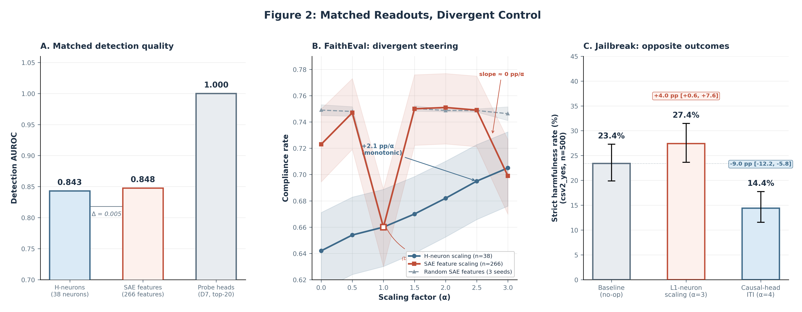

# 4. Case Study I: From Localization to Control

This section presents the paper's core empirical contribution: across two intervention families and two evaluation surfaces in Gemma-3-4B-IT, strong or even perfect predictive readouts did not reliably identify useful steering targets. The failure was not the absence of signal, but the unreliability of signal quality as a target-selection heuristic.

We organize the evidence from cleanest to most informative. Section 4.1 establishes that the readouts under study are genuine held-out signals, not strawmen. Section 4.2 presents the sharpest single experiment: matched detection quality between magnitude-ranked neurons and SAE features, with divergent steering outcomes. Section 4.3 introduces the most stringent selector-level result: perfect probe-head discrimination that yields zero intervention effect, contrasted with a gradient-based selector that achieves significant harm reduction. Section 4.4 positions the gradient-based result as supporting evidence with explicit caveats.

Figure 2 shows the two strongest control dissociations side by side: matched H-neuron/SAE detection on FaithEval with divergent steering, and a jailbreak selector contrast where changing the selector changes the outcome.

*Figure 2. Panel A shows matched detection quality; Panel B shows neuron steering rising while SAE steering stays flat relative to SAE-random controls; Panel C shows selector-level divergence on jailbreak.*

## 4.1 The Readouts Are Real

The intervention targets examined below were selected through held-out predictive readouts that meet or exceed conventional standards. This matters because the subsequent null steering results are only informative if the underlying detection signal is genuine.

**Magnitude-ranked neurons.** A CETT probe (Gao et al., 2025) trained on FaithEval context-grounding activations identified 38 neurons (out of 348,160 total feed-forward neurons across 34 layers) with positive logistic regression weight at regularization strength $C = 1.0$. On a disjoint held-out split, this probe achieved AUROC $0.843$ (accuracy $76.5\%$, $n_{\text{test}} = 780$).[^fn-classifier-structure] The 38 neurons span 23 of 34 layers, with concentration in early layers (18 neurons, 47.4%, in layers 0--10).[^fn-classifier-structure]

**SAE features.** An L1 logistic regression probe trained on Gemma Scope 2 sparse autoencoder activations (16k-width SAEs across 10 layers) selected 266 positive-weight features at $C = 0.005$, achieving AUROC $0.848$ (accuracy $77.2\%$, $n_{\text{test}} = 782$).[^fn-classifier-sae] This marginally exceeds the CETT probe but falls within its bootstrap confidence interval $[0.815, 0.870]$ and uses $7\times$ more features.[^fn-sae-audit]

**Probe-ranked attention heads.** For the jailbreak intervention setting, a per-head AUROC probe trained on harmful/benign activation contrasts from JailbreakBench produced a top-20 head set where the two highest-ranked heads each achieved AUROC $1.0$ (balanced accuracy $1.0$ and $0.95$, respectively), and all 20 selected heads scored between $0.87$ and $1.0$.[^fn-probe-metadata]

**Interpretation caveats.** While the aggregate detection signal is robust, its interpretation at the individual-component level is less clear. The highest-weight neuron in the CETT probe (L20:N4288, weight $12.169$, contributing $30.7\%$ of top-10 weight mass) failed all six causal importance tests, is absent at $C \le 0.3$, appears at $C = 1.0$, and drops to rank 5 at $C = 3.0$, where a 219-neuron detector achieves $80.5\%$ accuracy.[^fn-classifier-structure] A verbosity confound analysis found that response length dominates truthfulness signal by a factor of $3.7$--$16\times$ in full-response readouts.[^fn-strat-assessment] These observations do not undermine the held-out AUROC values — which measure genuine discrimination — but they caution against interpreting probe weights as a guide to mechanistic importance. Appendix A summarizes the detector-interpretation audits that motivate this caution.

[^fn-classifier-structure]: `data/gemma3_4b/pipeline/classifier_structure_summary.json`; classifier: `models/gemma3_4b_classifier_disjoint.pkl`; test AUROC $= 0.8429$.
[^fn-classifier-sae]: `data/gemma3_4b/pipeline/classifier_sae_summary.json`; classifier: `models/sae_detector.pkl`; test AUROC $= 0.8477$, $n_{\text{positive}} = 266$ features across 10 layers.
[^fn-sae-audit]: `data/gemma3_4b/intervention/faitheval_sae/sae_pipeline_audit.md`, Finding 3.
[^fn-probe-metadata]: `data/contrastive/refusal/iti_refusal_probe_d7/extraction_metadata.json`; top-2 heads: L10:H6 (AUROC $1.0$, balanced accuracy $1.0$) and L2:H6 (AUROC $1.0$, balanced accuracy $0.95$).
[^fn-strat-assessment]: `data/gemma3_4b/intervention/verbosity_confound/verbosity_confound_audit.md`; summarized in Appendix A alongside the N4288 audit.

## 4.2 Magnitude-Ranked Neurons vs. SAE Features on FaithEval

This comparison is the paper's cleanest single experiment. Both methods achieve matched detection quality on the same benchmark, same model, and same behavioral construct (context-grounding compliance on FaithEval, $n = 1{,}000$). The only difference is the representational basis for intervention: neurons in the feed-forward network's down-projection input space versus features in a sparse autoencoder's latent space.

### Setup

**Magnitude-ranked neuron intervention.** The 38 CETT-selected neurons were scaled multiplicatively: at each forward pass, the activation of each selected neuron was multiplied by $\alpha \in \{0.0, 0.5, 1.0, 1.5, 2.0, 2.5, 3.0\}$, where $\alpha = 1.0$ is the identity (no-op). This intervention operates directly in the model's feed-forward computation, requiring no auxiliary encoding or decoding step.

**SAE feature intervention.** The 266 classifier-selected SAE features were scaled through an encode-modify-decode cycle: at each token position, activations were encoded through the Gemma Scope 2 SAE, target features were multiplied by $\alpha$, and the modified representation was decoded back to activation space. At $\alpha = 1.0$, the hook returned the original activation unchanged (early return, no encode/decode applied). This design follows the methodology described in Arad et al. (2025) for SAE-based behavioral steering.

**Evaluation.** Compliance was scored deterministically via regex-based letter extraction on FaithEval's multiple-choice format ($n = 1{,}000$ items). The primary metric was compliance rate (proportion of items where the model selected the misleading answer consistent with the provided context, against explicit instructions).

### Results

**Table 3 — FaithEval Compliance by Intervention Method and Scaling Factor**

| $\alpha$ | Neurons (38) | SAE H-features (266) | SAE random (mean $\pm$ SD, 3 seeds) |
|---|---|---|---|
| 0.0 | 64.2% [61.2, 67.1] | 72.3% [69.4, 75.0] | 74.9% $\pm$ 0.4 |
| 0.5 | 65.4% [62.4, 68.3] | 74.7% [71.9, 77.3] | 74.8% $\pm$ 0.4 |
| 1.0 | 66.0% [63.0, 68.9] | **66.0%** [63.0, 68.9] | **66.0%** $\pm$ 0.0 |
| 1.5 | 67.0% [64.0, 69.8] | 75.0% [72.2, 77.6] | 75.0% $\pm$ 0.2 |
| 2.0 | 68.2% [65.2, 71.0] | 75.1% [72.3, 77.7] | 74.9% $\pm$ 0.1 |
| 2.5 | 69.5% [66.6, 72.3] | 74.9% [72.1, 77.5] | 74.9% $\pm$ 0.1 |
| 3.0 | 70.5% [67.6, 73.2] | 69.9% [67.0, 72.7] | 74.6% $\pm$ 0.5 |

Wilson 95% CIs shown for neurons and SAE H-features ($n = 1{,}000$). $\alpha = 1.0$ is the no-op baseline for both intervention modes.[^fn-faitheval-results][^fn-sae-comparison]

**Neuron steering showed a significant, monotonic dose-response.** The magnitude-ranked neuron compliance slope was $+2.09$ pp/$\alpha$ $[1.38, 2.83]$ (paired bootstrap 95% CI, 10,000 resamples). The Spearman rank correlation between $\alpha$ and compliance rate was $\rho = 1.0$ (perfectly monotonic). Relative to the $\alpha = 1.0$ no-op baseline, compliance at $\alpha = 3.0$ increased by $+4.5$ pp $[2.9, 6.1]$. The full $\alpha = 0 \rightarrow 3$ sweep, which includes recovery from ablation at $\alpha = 0$, spans $+6.3$ pp $[4.2, 8.5]$.[^fn-faitheval-results]

**SAE feature steering was indistinguishable from zero.** The H-feature compliance slope was $+0.16$ pp/$\alpha$ $[-0.51, 0.84]$ — the confidence interval includes zero. The Spearman correlation was $\rho = 0.18$ (no monotonic trend). Random SAE features (266 features drawn from zero-weight classifier positions, 3 seeds) produced a mean slope of $+0.59$ pp/$\alpha$ $[0.54, 0.64]$.[^fn-sae-comparison]

**The slope difference confirms the divergence.** The neuron-minus-SAE slope difference was $+1.93$ pp/$\alpha$ $[+0.94, +2.92]$ (paired bootstrap 95% CI, 10,000 resamples, same 1,000 items; permutation $p < 0.001$, 4/50,000 permutations $\geq$ observed gap).[^fn-slope-diff] The confidence interval excludes zero, confirming that the neuron dose-response was significantly steeper than the SAE dose-response on the same evaluation surface.

The distinction between the two SAE null summaries matters for cross-document consistency. The main full-sweep result reported in this paper is the $+0.16$ pp/$\alpha$ null above; the $+0.12$ pp/$\alpha$ figure reported later refers to the delta-only control that removes reconstruction error as an explanation for the null.

**H-features performed worse than random features at $\alpha = 3.0$.** At the highest scaling factor, classifier-selected SAE features yielded $69.9\%$ compliance versus $74.6\%$ for random SAE features — a $-4.7$ pp difference in the wrong direction. If the 266 selected features encoded the compliance mechanism, amplifying them should have produced larger gains than amplifying random features. The reversal is consistent with over-amplification of compliance-correlated but causally irrelevant features disrupting the decode reconstruction.[^fn-sae-audit-finding2]

### The SAE Encode/Decode Cycle Is Not the Explanation

A natural objection is that the SAE's lossy reconstruction (relative L2 error $= 0.1557$) destroyed the steering signal. We tested this directly with a delta-only architecture that cancels reconstruction error exactly: $\mathbf{h}_t + \text{decode}(\mathbf{f}_{\text{modified}}) - \text{decode}(\mathbf{f}_{\text{original}})$, where only the targeted feature modifications propagate to the residual stream.[^fn-sae-delta]

The delta-only H-feature slope was $+0.12$ pp/$\alpha$, and the delta-only random slope was $-0.09$ pp/$\alpha$ — both indistinguishable from zero. The neuron baseline on the same three-alpha subset was $+2.12$ pp/$\alpha$. The delta-only architecture also eliminated the ${\sim}8$--$9$ pp compliance shift caused by lossy reconstruction (all non-identity alphas had produced elevated compliance regardless of feature selection under the full-replacement architecture) and reduced parse failures from $1.4$--$2.3\%$ to zero.[^fn-sae-delta]

This rules out reconstruction error as the primary confounder. The SAE steering null reflects genuine feature-space misalignment: features that correlate with hallucination in static activation readouts do not causally control compliance when manipulated through the SAE's encode-modify-decode pathway.

### Neuron Specificity Is Confirmed by Negative Controls

To establish that the neuron dose-response reflects the specific identity of the 38 selected neurons rather than a generic perturbation effect, we ran two families of negative controls: 5 unconstrained random neuron sets (38 neurons each, drawn uniformly from all 348,160 feed-forward neurons) and 3 layer-matched random neuron sets (38 neurons with the same layer distribution as the CETT selection, drawn from non-selected neurons within those layers). In total, 8 independent random seeds were evaluated across the same alpha sweep.[^fn-faitheval-control]

All 8 random seeds produced null compliance slopes. The mean unconstrained-random slope was $+0.02$ pp/$\alpha$ $[-0.11, 0.16]$ (95% empirical percentile interval across 5 seeds), and the mean layer-matched slope was $+0.17$ pp/$\alpha$ $[0.15, 0.21]$. No random seed produced a monotonic dose-response. At $\alpha = 3.0$, the H-neuron compliance rate ($70.5\%$) exceeded the 95th percentile of the random distribution ($65.8$--$66.5\%$).[^fn-faitheval-control]

The H-neuron slope of $+2.09$ pp/$\alpha$ exceeds the maximum observed random slope ($+0.21$ pp/$\alpha$, layer-matched seed 0) by an order of magnitude. Paired bootstrap slope differences (neuron minus random, same 1,000 items) ranged from $+1.89$ to $+2.20$ pp/$\alpha$ across all 8 seeds, with every CI excluding zero and every permutation $p < 0.001$.[^fn-slope-diff-ctrl] The intervention effect is neuron-specific, not a property of generic 38-neuron perturbations at this scale.

### Summary

Detection quality was matched: AUROC $0.843$ (neurons) versus $0.848$ (SAE features). Steering diverged completely: $+2.09$ pp/$\alpha$ $[1.38, 2.83]$ versus $+0.16$ pp/$\alpha$ $[-0.51, 0.84]$; the slope difference was $+1.93$ pp/$\alpha$ $[+0.94, +2.92]$ (permutation $p < 0.001$). The failure was not attributable to reconstruction error (delta-only architecture confirmed the null) or to generic perturbation effects (8 random-neuron seeds confirmed specificity, all slope-difference CIs excluding zero). Matched readout quality did not predict matched intervention utility.

[^fn-faitheval-results]: `data/gemma3_4b/intervention/faitheval/experiment/results.json`; slope and delta CIs from paired bootstrap (10,000 resamples, seed 42).
[^fn-sae-comparison]: `data/gemma3_4b/intervention/faitheval_sae/control/comparison_summary.json`.
[^fn-sae-audit-finding2]: `data/gemma3_4b/intervention/faitheval_sae/sae_pipeline_audit.md`, Finding 2.
[^fn-sae-delta]: `data/gemma3_4b/intervention/faitheval_sae/sae_pipeline_audit.md`, Confound 1; data in `data/gemma3_4b/intervention/faitheval_sae_delta/`.
[^fn-faitheval-control]: `data/gemma3_4b/intervention/faitheval/control/comparison_summary.json`; 5 unconstrained seeds (slopes: $+0.17$, $-0.00$, $-0.07$, $-0.11$, $+0.11$ pp/$\alpha$) and 3 layer-matched seeds (slopes: $+0.21$, $+0.16$, $+0.15$ pp/$\alpha$).
[^fn-slope-diff]: `data/gemma3_4b/intervention/faitheval_sae/control/slope_difference_summary.json`; paired bootstrap (10,000 resamples, seed 42) and permutation test (50,000 permutations, seed 43).
[^fn-slope-diff-ctrl]: `data/gemma3_4b/intervention/faitheval/control/slope_difference_summary.json`; per-seed paired bootstrap slope differences (10,000 resamples each, seed 42) and permutation tests (50,000 permutations each).

## 4.3 Probe-Ranked Heads vs. Gradient-Ranked Heads on Jailbreak

The FaithEval comparison (Section 4.2) showed that matched detection quality did not guarantee matched steering. This section presents a stronger version of the same dissociation: *perfect* detection quality producing zero intervention effect.

### Setup

Both interventions operate at the attention-head level using Inference-Time Intervention (ITI; Li et al., 2023): a learned direction vector is added to the residual stream contribution of each selected head during decoding. The two methods differ only in how heads are ranked for selection.

**Probe-ranked selection.** Each of the model's 272 attention heads (34 layers $\times$ 8 heads) was scored by its held-out AUROC on a harmful/benign activation contrast derived from JailbreakBench prompts. The top-20 heads were selected for intervention. As reported in Section 4.1, the top two heads achieved AUROC $= 1.0$, and all 20 selected heads scored between $0.87$ and $1.0$.[^fn-probe-metadata]

**Gradient-ranked selection.** Each head was scored by the mean absolute gradient of the model's refusal probability with respect to a rank-1 approximation of the head's output, computed on the same harmful/benign contrast set. This is a causal criterion: it measures how much perturbing each head's output changes the model's tendency to refuse, rather than how well the head's activations predict the behavioral label.[^fn-causal-metadata]

**Evaluation.** Both selectors were tested at matched intervention strength ($k = 20$ heads). The probe family was evaluated on the pilot ($n = 100$) across $\alpha \in \{0.0, 1.0, 2.0, 4.0, 8.0\}$. The gradient-ranked family was evaluated on the full-500 confirmatory run ($n = 500$) at its locked alpha ($\alpha = 4.0$) against a shared no-op baseline. The primary metric was strict harmfulness rate: the proportion of responses judged as unambiguously harmful under CSV-v2 graded severity scoring (Bhalla et al., 2024).[^fn-d7-pilot][^fn-d7-full500]

### Results

**Probe-ranked heads: null at every alpha.** The best probe intervention produced a $-2$ pp change in strict harmfulness rate $[-10, +6]$ (paired bootstrap 95% CI, $n = 100$). At $\alpha = 8.0$, the probe intervention *increased* harmful compliance by $+6$ pp (from 30 to 36 strictly harmful responses, with $+12$ pp $[+3, +21]$ on binary judge compliance), accompanied by 82\% of responses hitting the 5,000-token generation cap — consistent with model degeneration rather than genuine behavioral change.[^fn-d7-pilot]

**Gradient-ranked heads: significant harm reduction.** On the full-500 confirmatory run against a shared no-op baseline (strict harmfulness rate: $23.4\%$, 117/500), the gradient-ranked intervention at $\alpha = 4.0$ reduced strict harmfulness to $14.4\%$ (72/500): $-9.0$ pp $[-12.2, -5.8]$. The binary judge moved in the same direction: $-10.6$ pp $[-14.0, -7.2]$. Severity-sensitive CSV-v2 component scores (commitment $C$: $-0.40$ $[-0.47, -0.33]$; specificity $S$: $-0.46$ $[-0.55, -0.37]$) confirmed that the reduction reflected genuine deescalation, not merely a shift in judge threshold.[^fn-d7-full500]

**The two selectors identified fundamentally different heads.** Jaccard similarity between the probe-ranked and gradient-ranked top-20 sets was $0.11$: only 4 heads overlapped out of 36 unique heads. The gradient-ranked selector concentrated in layer 5 (4 heads) and selected late-layer heads (layers 27--28), while the probe selector concentrated in layers 4 and 9 with high AUROC ($0.87$--$1.0$) but no gradient signal.[^fn-d7-pilot]

**Table 4 — Probe vs. Gradient Selector: Detection Quality and Steering Outcome**

| Property | Probe-ranked (top 20) | Gradient-ranked (top 20) |
|---|---|---|
| Ranking criterion | Per-head AUROC on harmful/benign contrast | Mean $|\nabla|$ of refusal probability w.r.t. head output |
| Detection quality (top heads) | AUROC $1.0$ / $1.0$ / $0.99$ / $0.98$ / $0.96$ | Not applicable (causal, not discriminative) |
| Best steering effect | $-2$ pp $[-10, +6]$ (null) | $-9.0$ pp $[-12.2, -5.8]$ |
| Jaccard overlap with other selector | 0.11 (4/36 heads) | 0.11 (4/36 heads) |
| Head concentration | Layers 4, 9 | Layers 5, 27--28 |

### Interpretation

The probe-ranked heads discriminated harmful from benign activations perfectly, yet perturbing them produced no behavioral change. The gradient-ranked heads were never assessed for discriminative quality, yet intervening on them reduced harmful compliance by 9.0 pp with a confidence interval excluding zero.

This dissociation is stronger than the FaithEval result in one respect: the probe readout was not merely *matched* but *perfect* (AUROC $= 1.0$ on the top heads). If readout quality were a reliable proxy for steering utility, the probe-ranked set should have been the stronger intervention target. Instead, it was inert.

The result is consistent with a distinction between components that *encode* a behavioral label and components that *control* the labeled behavior. Probe-ranked heads may sit downstream of the decision mechanism — well-positioned to read out the model's already-committed behavioral state, but unable to change it when perturbed. Gradient-ranked heads, by contrast, are selected precisely for their causal influence on the behavioral output. Wu et al. (2025) document a related predict/control gap in the AxBench evaluation of SAE features. Bhalla et al. (2024) observe that some features score well on predict metrics and poorly on control metrics within their framework.

[^fn-causal-metadata]: `data/contrastive/refusal/iti_refusal_causal_d7/extraction_metadata.json`; gradient computed as mean $|\partial p_{\text{refuse}} / \partial \mathbf{v}_{\text{head}}|$ over the harmful/benign contrast set.
[^fn-d7-pilot]: `notes/act3-reports/2026-04-07-d7-causal-pilot-audit.md`; probe results from pilot ($n = 100$), 5 alphas.
[^fn-d7-full500]: `notes/act3-reports/2026-04-08-d7-full500-audit.md`; full-500 confirmatory run, structured summary at `data/gemma3_4b/intervention/jailbreak_d7/full500_canonical/d7_csv2_report.json`.

## 4.4 Gradient-Based Selection as Supporting Comparator

The gradient-ranked result in Section 4.3 demonstrates that an alternative selection criterion can produce significant behavioral change where probe-based selection failed. This is valuable as a contrast, but three caveats prevent us from making a strong standalone claim about the gradient-based method.

**Caveat 1: No random-head control.** The full-500 confirmatory run did not include a random-head negative control at matched $k = 20$ and $\alpha = 4.0$. Without this control, we cannot distinguish between two explanations: (a) the gradient-ranked heads are specifically the right components to perturb, or (b) any sufficiently strong head-level perturbation at this alpha produces apparent harm reduction. The pilot probe-null is informative (probe-ranked perturbation at the same $k$ was inert) but is not a matched random-head control.[^fn-d7-full500]

**Caveat 2: Model degeneration is visible.** At $\alpha = 4.0$, 112 of 500 gradient-ranked responses (22.4%) hit the 5,000-token generation cap, compared to 0% at baseline. Subset analysis showed that the safety gain persisted in both cap-hit and non-cap subsets (non-cap: $-9.8$ pp $[-13.7, -5.9]$; cap-hit: $-6.3$ pp $[-11.6, -0.9]$), and 97 of 112 cap-hit responses were scored safe rather than strictly harmful. The degeneration pattern was consistent with verbose refusal drift rather than hidden harmfulness, but it represents a quality cost that must be reported alongside the safety gain.[^fn-d7-full500]

**Caveat 3: Benchmark-local.** The gradient-ranked intervention was evaluated on a single benchmark (JailbreakBench, $n = 500$). Its behavior on other evaluation surfaces — factual accuracy, fluency, instruction following — remains untested.

**What the comparator does establish.** Despite these caveats, the gradient-based result serves two roles in the paper's argument. First, it confirms that the probe-null is not an artifact of the ITI intervention family being inherently incapable on this benchmark: the same intervention architecture, applied to different heads, produced a significant effect. Second, the low Jaccard overlap (0.11) between selectors demonstrates that the two ranking criteria surface genuinely different model components — the behavioral divergence follows from a component-selection divergence, not from a superficial implementation difference.

For the purpose of this paper's thesis, the gradient-ranked result functions as an existence proof: on this benchmark and generation surface, a causally motivated selection criterion identified targets that a discriminative criterion missed. We do not claim that gradient-based selection is universally superior; the missing random-head control prevents this.

## 4.5 Synthesis

**Table 5 — Summary of Detection-Steering Dissociations**

| Comparison | Detection | Steering | Slope difference | Control evidence | Lesson |
|---|---|---|---|---|---|
| Neurons vs. SAE features (FaithEval) | AUROC $0.843$ vs. $0.848$ | $+2.09$ pp/$\alpha$ $[1.38, 2.83]$ vs. $+0.16$ pp/$\alpha$ $[-0.51, 0.84]$ | $+1.93$ pp/$\alpha$ $[+0.94, +2.92]$, $p < 0.001$ | 8-seed neuron null; delta-only SAE null | Matched detection, divergent steering |
| Probe vs. gradient heads (jailbreak) | AUROC ${\geq}0.92$ (top-20) vs. not assessed | Best $-2$ pp $[-10, +6]$ vs. $-9.0$ pp $[-12.2, -5.8]$ | Not applicable (asymmetric design)[^fn-asym] | Probe null is clean; gradient lacks random-head control | Perfect detection, zero intervention |

Two patterns emerge from Table 5, and both are necessary for the paper's claim.

First, detection quality did not predict steering success. The SAE probe matched the neuron probe on held-out AUROC and failed entirely on steering; the probe-ranked heads achieved perfect discrimination and produced no behavioral change. In neither case was the failure attributable to a confound: the delta-only architecture ruled out reconstruction error in the SAE comparison, and the inert probe-ranked heads shared the same intervention family (ITI) that succeeded under gradient-based selection.

Second, the failures were not caused by the absence of signal — they were caused by the wrong *kind* of signal. The distinction between components that *read out* a behavioral state and components that *control* it is not captured by held-out discriminative performance. Magnitude-ranked neurons happened to lie in the causal path for FaithEval compliance; SAE features of matched detection quality did not. Gradient-ranked attention heads lay in the causal path for jailbreak refusal; probe-ranked heads of superior detection quality did not.

The positive counterexample is important: magnitude-ranked neurons *did* steer FaithEval compliance ($+4.5$ pp $[2.9, 6.1]$ above the no-op baseline at $\alpha = 3.0$; slope $+2.09$ pp/$\alpha$), with specificity confirmed against 8 random-neuron seeds. The thesis is not that detection-based targets never work. It is that detection quality alone is an unreliable heuristic for identifying when they will.

[^fn-asym]: The probe-ranked and gradient-ranked selectors were evaluated at different sample sizes ($n = 100$ vs. $n = 500$) and different alpha grids, so a formal paired slope-difference test is not applicable. The inferential contrast rests on one effect being null (CI includes zero) while the other is significant (CI excludes zero).
