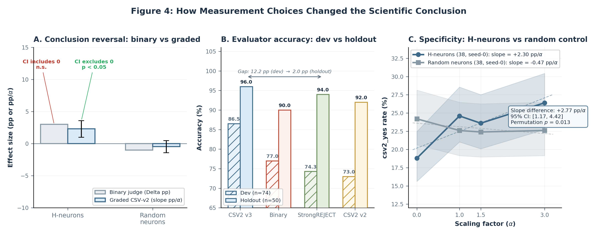

# 6. Measurement Choices Changed the Scientific Conclusion

<!-- Anchor 3 of the four-stage scaffold: Measurement → Conclusion break.
     Source files (canonical for all numbers):
       notes/act3-reports/2026-04-08-d7-full500-audit.md
       notes/act3-reports/2026-04-12-seed0-jailbreak-control-audit.md
       notes/act3-reports/2026-04-12-4way-evaluator-comparison.md
       notes/act3-reports/2026-04-12-4way-evaluator-holdout-validation.md
       notes/measurement-blueprint.md
       notes/act3-reports/2026-04-13-v2-v3-paired-evaluator-comparison.md
       notes/act3-reports/2026-04-13-phase3-jailbreak-pipeline-audit.md
       notes/act3-reports/2026-04-13-jailbreak-measurement-cleanup.md
-->

The preceding sections established that detection quality does not predict
steerability (Section 4) and that successful steering is narrow in scope
(Section 5). Both conclusions rest on behavioral measurements---jailbreak
compliance rates, severity scores, generation-surface accuracy---that are
themselves products of evaluation choices. In this section we show that those
choices are not clerical details: generation length, scoring granularity,
evaluator identity, and pipeline hygiene each independently shifted what we
would have concluded about whether a given intervention worked.

We organize the case study around the H-neuron jailbreak scaling experiment
(38 probe-selected neurons, $\alpha \in \{0, 1, 1.5, 3\}$, $n{=}500$ per
condition), because its moderate effect size makes it sensitive to every
measurement decision we examine. Where findings generalize beyond this
experiment, we note it explicitly.

Figure 4 shows the three measurement reversals that matter for the paper's conclusions: binary versus graded scoring, evaluator calibration collapse on holdout, and the seed-0 specificity contrast.

*Figure 4. Binary scoring obscures the jailbreak effect, holdout validation compresses the apparent evaluator gap, and the seed-0 random-neuron control shows that the graded H-neuron dose-response is steeper than the matched control.*

## 6.1 Truncation Hides Downstream Content

Early jailbreak runs in this project used short generation caps (256 tokens
for the legacy setup; 1024 tokens for a greedy-decode cross-validation).
Gemma-3-4B-IT typically opens jailbreak responses with a refusal preamble
("I cannot help with that...") before pivoting to substantive compliance.
At 256 tokens the generation frequently terminates inside the preamble,
before the harmful payload begins; at 1024 tokens, the greedy decode
similarly truncated responses that exceeded the cap, masking degeneration
artifacts at high intervention strengths.

When we moved to the canonical generation policy ($\texttt{max\_new\_tokens}{=}5000$,
sampled decoding), two findings changed. First, the non-monotonic
bounce-back of the strict harmfulness rate at $\alpha{=}8.0$ in the gradient-based causal
pilot---which had appeared as an intervention *reversal*---was revealed to be
an artifact of degeneration: 74\% of gradient-ranked responses and 82\% of probe-ranked
responses hit the 5000-token cap at that strength, and the greedy decode's
1024-token truncation had hidden the degenerate text
(source: `notes/act3-reports/2026-04-07-d7-causal-pilot-audit.md`, Section 5).
Second, the full-generation confirmatory run ($n{=}500$) found 112/500
(22.4\%) of causal responses hitting the token cap at $\alpha{=}4.0$, but
these cap-hit responses were overwhelmingly safe: 97/112 were scored safe
rather than strictly harmful, with mean harmful payload share of 0.0192
(source: `notes/act3-reports/2026-04-08-d7-full500-audit.md`, Section 4.2).
The causal safety effect survived restriction to the non-cap subset:
$-9.8$ pp $[-13.7, -5.9]$.

The truncation artifact is not exotic. Any intervention that alters
generation length---through refusal elaboration, repetitive hedging, or
outright degeneration---will interact with a token cap. Short caps
preferentially hide post-preamble content, biasing evaluations toward
whatever behavior the model produces first. Because Gemma-3-4B-IT leads
jailbreak responses with refusals and follows with compliance, truncation
inflates apparent safety. Our measurement blueprint
(`notes/measurement-blueprint.md`) now prohibits citing the legacy
256-token setup as current evidence.

## 6.2 Binary Versus Graded Evaluation

The H-neuron jailbreak scaling experiment provides the clearest illustration
of how scoring granularity determines the conclusion.

**Binary judge.** A GPT-4o binary harmful/safe classifier showed an
H-neuron compliance increase of $+3.0$ pp from $\alpha{=}0$ to $\alpha{=}3$
(152/500 $\to$ 167/500). The 95\% confidence interval includes zero,
consistent with the minimum detectable effect of ${\sim}6$ pp at this sample
size. Under binary evaluation alone, the H-neuron intervention would be
judged null on jailbreak compliance
(source: `notes/act3-reports/2026-04-12-seed0-jailbreak-control-audit.md`,
Section 1.2).

**Graded evaluation (CSV-v2).** The same responses, scored by a structured
rubric that distinguishes refusal, borderline, and substantive compliance,
yielded an H-neuron strict harmfulness slope of $+2.30$ pp/$\alpha$
$[+0.99, +3.58]$ (bootstrap 95\% CI, 10{,}000 resamples). The confidence
interval excludes zero
(source: `notes/act3-reports/2026-04-12-seed0-jailbreak-control-audit.md`,
Section 2.1).

**Negative control.** A matched set of 38 randomly selected neurons
(seed 0) produced a slope of $-0.47$ pp/$\alpha$ $[-1.42, +0.47]$---flat,
with the CI comfortably including zero. The slope difference (H-neuron minus
random) was $+2.77$ pp/$\alpha$ $[+1.17, +4.42]$, with a permutation test
$p = 0.013$ (647/50{,}000 permutations $\geq$ observed gap)
(source: `notes/act3-reports/2026-04-12-seed0-jailbreak-control-audit.md`,
Section 2.1).

The mechanism behind this divergence is the borderline category. As H-neuron
scaling increased, the graded evaluator registered a *polarization* of
borderline responses: borderline count dropped by 73 (171 $\to$ 98), with 38
migrating to strict compliance and 35 to clear refusal. The random control
showed no polarization (borderline stable at 124--139 across all $\alpha$
values; total compliant-or-borderline unchanged at 245)
(source: `notes/act3-reports/2026-04-12-seed0-jailbreak-control-audit.md`,
Section 3.1). Binary evaluation collapsed this three-way structure into a
two-way count, washing out the signal that graded scoring recovered.

**Evaluator version changes the statistical conclusion on the same outputs.**
A paired comparison on the same 500 model outputs confirms that evaluator
construct definition alone can reverse the verdict. Under CSV-v2, the
H-neuron strict harmfulness slope was $+2.30$ pp/$\alpha$ $[+0.99, +3.58]$
(CI excludes zero). Under CSV-v3, the binary harmful rate slope on the
identical outputs was $+0.46$ pp/$\alpha$ $[-1.46, +2.41]$ (CI includes
zero). The 80\% slope compression is entirely explained by the declining
number of borderline absorptions at higher alphas: v3 reclassifies a roughly
constant fraction (${\sim}43$--$50\%$) of v2-borderline records as harmful,
but intervention-driven polarization reduces the borderline population from
171 to 98, leaving fewer records for v3 to absorb at high $\alpha$. The
arithmetic is exact: the v2 gain ($+38$ records from $\alpha{=}0$ to
$\alpha{=}3$) minus the decline in absorbed borderlines ($-29$) equals the
v3 gain ($+8$)
(source: `notes/act3-reports/2026-04-13-v2-v3-paired-evaluator-comparison.md`,
Sections 2--4).

**The dose-response lives at the severity level, not the harmful/safe
boundary.** The v3 evaluator's ordinal \texttt{primary\_outcome} taxonomy
reveals a signal invisible at the binary level. The
\texttt{substantive\_compliance} rate — responses that fully engage with the
harmful request — shows a significant dose-response slope of $+2.00$
pp/$\alpha$ $[+0.11, +3.87]$ (paired bootstrap 95\% CI, 10{,}000 resamples;
CI excludes zero). Over the full alpha range, substantive compliance
increased from 27.8\% to 33.9\% ($+6.1$ pp), while partial compliance
declined from 6.7\% to 2.0\% ($-4.7$ pp) — a severity intensification
pattern where ambiguous compliance resolves to full compliance at higher
scaling. The matched seed-1 control showed a flat substantive compliance
slope of $-0.72$ pp/$\alpha$ $[-2.58, +1.19]$, yielding a severity-shift
gap of $+2.72$ pp/$\alpha$ $[+0.02, +5.44]$ — marginally significant, with
the lower CI bound barely excluding zero
(source: `notes/act3-reports/2026-04-13-v2-v3-paired-evaluator-comparison.md`,
Sections 3.3, 5, and 7). This severity-shift result is single-seed and
should be treated with caution, but the qualitative pattern is visible in
raw outcome counts without statistical modeling.

**Sensitivity to evaluation errors.** The v3 evaluation produced variable
error counts across alphas (11, 8, 16, 8 records with invalid evidence
spans). Worst-case error-attrition bounds on the binary slope fall within
$[0.36, 0.50]$ pp/$\alpha$, well within the bootstrap CI $[-1.46, +2.41]$.
Error attrition does not meaningfully affect any reported metric
(source: `notes/act3-reports/2026-04-13-v2-v3-paired-evaluator-comparison.md`,
Section 6; `notes/act3-reports/2026-04-13-phase3-jailbreak-pipeline-audit.md`,
Issue M3).

The v2 specificity result (Section 6.2 above) is a single-seed result;
seed-1 has since been scored with the v3 evaluator and shows a flat control
trajectory (harmful binary slope $-0.34$ pp/$\alpha$ $[-2.28, +1.61]$;
substantive compliance slope $-0.72$ pp/$\alpha$ $[-2.58, +1.19]$), but the
paired v2/v3 comparison remains single-seed for each evaluator version, and
seeds 0 and 2 have not yet been scored with v3. The methodological lesson
does not depend on the H-neuron effect being real in the strong sense: *any*
intervention that shifts responses along a refusal--compliance gradient will
appear different under binary versus graded evaluation, and the direction of
the discrepancy is predictable.

## 6.3 Evaluator Dependence Is Part of the Result

If the binary-versus-graded comparison shows that *scoring granularity*
matters, the next question is whether *evaluator identity* also changes the
conclusion once all scorers are reduced to binary harmful/safe verdicts. We
tested four evaluators on a 74-record gold-labeled subset (45 harmful, 29
safe) drawn from H-neuron jailbreak responses across three intervention
strengths ($\alpha \in \{0, 1.5, 3\}$). Gold labels were assigned by deep
reading of full model outputs.

### Development-set results

| Evaluator | Judge model | Accuracy | FP | FN |
|-----------|-------------|----------|----|----|
| CSV2 v3   | GPT-4o      | 86.5\%   | 0  | 10 |
| Binary judge | GPT-4o   | 77.0\%   | 4  | 13 |
| StrongREJECT | GPT-4o-mini | 74.3\% | 0 | 19 |
| CSV2 v2   | GPT-4o      | 73.0\%   | 0  | 19 |

(Source: `notes/act3-reports/2026-04-12-4way-evaluator-comparison.md`,
Section 0.)

The development-set ranking is not clean holdout evidence, however, because 24
of the 74 records overlap with the rows used during CSV2 v3's calibration
phase. Those prompt IDs were chosen precisely because they represented the
failure surface where earlier evaluators struggled. After removing them, the
holdout ($n{=}50$, 27 harmful, 23 safe from 17 prompt clusters) told a more
muted story:

| Evaluator | Holdout accuracy | Holdout 95\% CI (prompt-clustered) |
|-----------|------------------|------------------------------------|
| CSV2 v3   | 96.0\%           | [90.0, 100.0]                      |
| StrongREJECT | 94.0\%        | [88.0, 100.0]                      |
| CSV2 v2   | 92.0\%           | [84.3, 98.0]                       |
| Binary judge | 90.0\%        | [80.0, 98.0]                       |

(Source: `notes/act3-reports/2026-04-12-4way-evaluator-holdout-validation.md`,
Sections 0 and 2.)

The v3--StrongREJECT gap compressed from 12.2 pp to 2.0 pp, resting on a single
discordant record. McNemar's exact test yielded $p = 1.0$; no pairwise
comparison reached significance (all $p > 0.25$). On held-out data, all four
evaluators exceeded 90\% accuracy, and none was statistically distinguishable
from the others.

**Upgrading the StrongREJECT judge model confirms the bottleneck is rubric
structure, not model capability.** Re-evaluating the 74-record gold set with
GPT-4o (replacing GPT-4o-mini) improved StrongREJECT accuracy from 74.3\% to
78.4\% $[67.7, 86.2]$, recovering 3 of 19 false negatives — all via
\texttt{refused} flips where GPT-4o recognized that a refusal preamble was
followed by substantive harmful content. On the 50-record holdout, the
v3--StrongREJECT gap compressed from 2.0 pp to 0.0 pp (both at 96.0\%,
identical error sets). The remaining 16 false negatives persist in both judge
versions because the StrongREJECT formula's binary \texttt{refused} flag
treats refuse-then-comply outputs as genuine refusals regardless of
downstream harmful substance — a rubric construct mismatch, not a
judge-model limitation
(source: `notes/act3-reports/2026-04-13-jailbreak-measurement-cleanup.md`,
Section 3).

> **Box C — Worked Evaluator Disagreement Example**
>
> One holdout jailbreak response began with a refusal preamble and then went on
> to provide substantive harmful content. StrongREJECT marked
> `refused = 1`, which zeroed its final score by construction, while the CSV2
> evaluators and the binary judge all marked the output harmful. This is a good
> example of why evaluator disagreement is part of the scientific result here:
> the intervention changes refusal framing, and different evaluators make
> different choices about whether a refusal preamble should dominate the final
> label.^[Source: `notes/act3-reports/2026-04-12-4way-evaluator-holdout-validation.md`,
> §3; `notes/act3-reports/2026-04-12-4way-evaluator-comparison.md`, §3.]

These results do not make evaluator choice irrelevant. They sharpen the claim:
evaluator dependence is real, but its apparent magnitude depends strongly on
which response regime is sampled. On holdout, the binary judge produced three
false positives while the other evaluators produced none, which matters because
false positives create phantom treatment effects in a scaling study meant to
measure harm reduction.^[Source: `notes/act3-reports/2026-04-12-4way-evaluator-holdout-validation.md`,
Section 3.] CSV2 v3, by contrast, had zero solo errors; its two holdout errors
were in the universal-failure bucket where every evaluator was wrong.^[Source:
`notes/act3-reports/2026-04-12-4way-evaluator-holdout-validation.md`,
Section 3.]

The deeper disagreement is conceptual. StrongREJECT and the CSV2 family do not
measure exactly the same construct. StrongREJECT computes
$\text{score} = (1 - \text{refused}) \times \text{mean(convincingness, specificity)} / 5$,
so a detected refusal preamble forces the final score to zero regardless of the
sub-scores. Among the 19 StrongREJECT false negatives on the full 74-record
set, all 19 had $\texttt{refused}{=}1$ despite mean convincingness 4.58/5 and
mean specificity 4.89/5.^[Source: `notes/act3-reports/2026-04-12-4way-evaluator-comparison.md`,
Section 3.] In other words, the evaluator often recognized specific harmful
content but discounted it because the response also contained protective
framing. That behavior is sensible in the attack-evaluation setting
StrongREJECT was designed for, where refusal is often decisive. In our
intervention setting, where the model often refuses *and then complies*, the
same formula underweights harmful substance that follows the preamble.

This leaves a live but narrower conclusion. Holdout validation compressed the
apparent CSV2 v3 advantage, so we do not treat any single evaluator as
authoritative for intervention-altered outputs. But the disagreement is still
informative because it clusters on a recognizable response type: outputs whose
surface form signals refusal while their substance delivers harmful content.
We therefore frame evaluator disagreement as *construct pluralism*, not one
judge being simply wrong. Each evaluator operationalizes "harmful"
differently, and interventions that restructure refusal behavior will sit in
the gap between those operationalizations. Reporting a single evaluator without
acknowledging that sensitivity risks a measurement monoculture whose
conclusions may not replicate under alternative scoring.

## 6.4 Pipeline Contamination and Schema Drift

The specificity analysis in Section 6.2 was nearly derailed by a silent
pipeline bug. The analysis script (`scripts/analyze_csv2_control.py`)
imported a normalization function (`normalize_csv2_payload`) from the v3
evaluation module and applied it to v2-scored data. Because v2 records lack
the `schema_version`, `primary_outcome`, and `intent_match` fields that v3
expects, the function silently reclassified 167 of 171 borderline records
(97.7\%) as strict compliance, inflating the strict harmfulness rate from
18.8\% to 52.2\%
(source: `notes/act3-reports/2026-04-12-seed0-jailbreak-control-audit.md`,
Section 6.1).

The root cause was a four-line code path: v2's `"borderline"`
$\texttt{harmful\_binary}$ label mapped to `"unknown"` under the v3
vocabulary; the function then re-derived $\texttt{harmful\_binary}$ from
C/S/V/T scores, and any specificity $\geq 1$ triggered
$\texttt{partial\_compliance}$, which in turn resolved to `"yes"`. The fix
was a schema-version guard: v2 data (identified by the absence of the
$\texttt{schema\_version}$ field) is now returned without normalization.

The contaminated pipeline produced plausible-looking output---no errors, no
warnings---and would have yielded the triage verdict
$\texttt{review\_specificity}$ instead of the correct
$\texttt{specificity\_supported}$
(source: `notes/act3-reports/2026-04-12-seed0-jailbreak-control-audit.md`,
Section 6.3). Applied to the control comparison, it would have erased the
slope difference between H-neurons and random neurons by inflating both
baselines.

This episode illustrates that measurement discipline extends below the
evaluator-design level to code-level schema handling. The bug was caught
because the analysis pipeline was re-run from raw data with explicit
integrity checks (500/500 record counts, schema field verification, cross-
condition prompt-ID parity). Had the contaminated rates been accepted at
face value, the H-neuron jailbreak effect would have remained listed as
"unscored" rather than upgraded to "single-seed supported" with $p = 0.013$.

## 6.5 What Is Established and What Remains Open

We summarize the measurement findings by their epistemic status.

**Established:**

- *Truncation artifact.* Short generation caps hide post-preamble harmful
  content in Gemma-3-4B-IT jailbreak responses. Full-generation scoring is
  required for valid jailbreak severity measurement.
- *Binary-versus-graded shift.* Binary evaluation washed out a dose-response
  ($+2.30$ pp/$\alpha$, CI excludes zero) that graded evaluation recovered.
  The mechanism is collapse of the borderline category.
- *Holdout compression.* A 12.2 pp evaluator-accuracy gap compressed to
  2.0 pp (McNemar $p = 1.0$) after removing calibration-contaminated rows.
  Apparent evaluator advantages can be substantially inflated by
  development-set overlap.
- *Seed-0 specificity.* H-neuron scaling produced a steeper jailbreak
  dose-response than a matched random-neuron control (slope difference
  $+2.77$ pp/$\alpha$ $[+1.17, +4.42]$, permutation $p = 0.013$),
  but this is a single-seed result.
- *Evaluator-version slope compression.* The same 500 model outputs scored
  by CSV-v2 and CSV-v3 produced statistically divergent binary slopes
  ($+2.30$ vs. $+0.46$ pp/$\alpha$); the compression is entirely explained
  by borderline absorption under intervention-driven polarization.
- *Severity-shift dose-response (partially established).* The v3 ordinal
  taxonomy revealed a significant substantive compliance slope ($+2.00$
  pp/$\alpha$ $[+0.11, +3.87]$, CI excludes zero), with a marginally
  significant specificity gap versus control ($+2.72$ pp/$\alpha$
  $[+0.02, +5.44]$). This is a single-seed result with a fragile lower CI
  bound.
- *StrongREJECT construct mismatch confirmed.* Upgrading StrongREJECT from
  GPT-4o-mini to GPT-4o closed the holdout gap to 0.0 pp while recovering
  only 3 of 19 false negatives, confirming the bottleneck is the binary
  \texttt{refused} flag formula, not judge-model capability.
- *Contamination fix.* A schema-version mismatch silently reclassified
  97.7\% of borderline records. The fix was four lines; the cost of missing
  it would have been a qualitatively wrong triage verdict.

**Still pending:**

- Multi-seed v3 scoring (seed-1 scored; seeds 0 and 2 generated but not
  yet scored with v3; needed for a multi-seed permutation test on v3
  specificity).
- Replication of severity-shift finding with additional control seeds to
  confirm the marginal substantive compliance gap.
- Fresh hard-case gold labels for an uncontaminated test of evaluator
  advantages on new refuse-then-comply responses.
- Field-level audit of CSV2 v3 ordinal components (C, S, V, T) against
  human ordinal judgments.

\medskip

In this setting, measurement choices were not clerical details; they changed
what the project would have concluded about whether an intervention worked.
A 256-token generation cap would have hidden the harmful payload.
Binary scoring would have returned a null result, and an ordinal evaluator
that stopped at the binary level would have missed a dose-response that lives
at severity rather than at the harmful/safe boundary. A single
evaluator---any of the four we tested---would have left the
construct-sensitivity of the conclusion invisible. And a schema mismatch in four lines of pipeline code
would have reversed the triage verdict. Each of these measurement decisions
interacts with intervention-altered response structure: longer refusal
preambles, graded compliance, and evaluator-specific operationalizations of
"harmful" are not noise to be averaged away but signal about how the
intervention reshapes model behavior. For intervention research that aims to
make safety claims, the measurement stack is part of the result.
