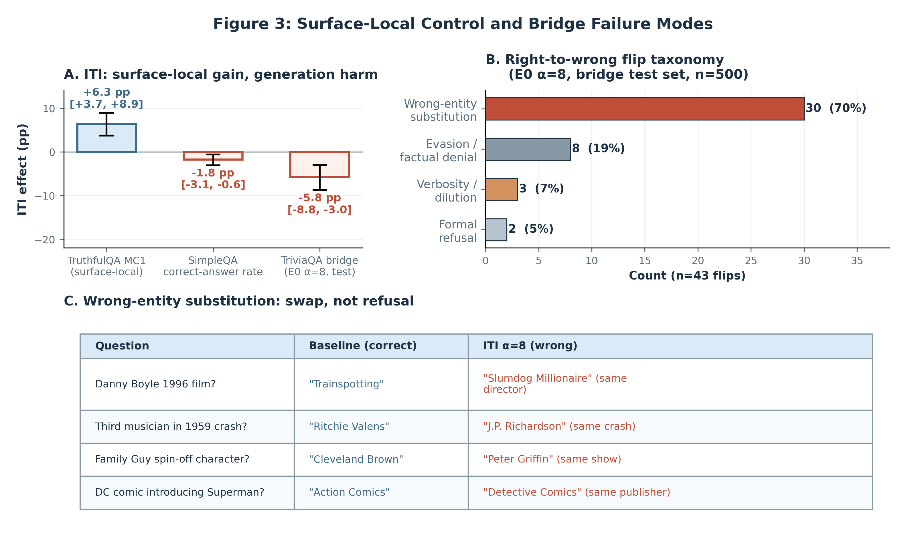

<!--
Generated file: do not edit directly.
Edit paper/draft source shards and rebuild with:
  uv run python scripts/build_full_paper.py
-->

# Finding the Signal, Losing the Wheel: The Paradox of Internal Readouts in Gemma-3-4B-IT

*A staged audit of measurement, localization, control, and externality in mechanistic intervention research.*

Hugo Nguyen

---

# Abstract

Predictive internal signals are often treated as natural targets for steering large language models, but their reliability as intervention handles remains unclear. We test this question in Gemma-3-4B-IT across contextual faithfulness, answer selection, open-ended factual generation, and jailbreak settings. The strongest localization result is a matched FaithEval comparison: SAE features and magnitude-ranked H-neurons have similar readout quality (AUROC 0.848 vs. 0.843), yet only H-neurons produce a reliable compliance dose-response (+2.1 pp/$\alpha$ [1.4, 2.8]; neuron-minus-SAE slope gap +1.9 pp/$\alpha$, CI excluding zero). When steering works, it remains surface-local: H-neurons are behaviorally active on BioASQ without a robust alias-accuracy gain, and TruthfulQA-sourced ITI improves answer selection by +6.3 pp MC1 but reduces TriviaQA bridge accuracy by $-5.8$ pp [$-8.8$, $-3.0$], most often through wrong-entity substitution. Measurement choices also change the conclusion: truncation, scoring granularity, and evaluator choice alter the apparent jailbreak result, and after the StrongREJECT GPT-4o rerun the holdout binary result is tied, leaving richer outcome taxonomy as the reason to prefer CSV-v3. We organize these findings as a four-stage audit framework and argue that strong readouts are insufficient evidence for good steering targets: credible mechanistic intervention claims require separate validation of measurement, localization, control, and externality.

---

# 1. Introduction

A predictive internal signal -- a neuron, feature, or direction that reliably discriminates between behavioral categories on held-out data -- is a tempting steering target. If a feature predicts whether a language model will produce a hallucination, a harmful response, or a factually incorrect answer, it is natural to expect that amplifying or suppressing that feature will steer the model toward the desired behavior. This heuristic underlies much recent work in activation steering: identify a strong readout, then intervene through it (Li et al., 2023; Gao et al., 2025; Arditi et al., 2024).

The heuristic sometimes works. Refusal-mediating directions identified by simple difference-in-means produce reliable refusal modulation (Arditi et al., 2024). Hallucination-associated neurons selected by classification performance can shift over-compliance behavior (Gao et al., 2025). But the heuristic also sometimes fails, and the failure modes have received less systematic attention than the successes. When a strong readout fails as a steering target, is the problem in the readout, the intervention operator, the evaluation, or the generalization?

This paper tests the readout-to-steering heuristic empirically in Gemma-3-4B-IT. We compare multiple intervention families -- neuron scaling, sparse autoencoder feature steering, inference-time intervention via attention heads, and gradient-based causal head selection -- across contextual faithfulness, answer selection, open-ended factual generation, and jailbreak settings. We find repeated dissociations between four stages that are routinely conflated:

1. **Measurement** -- Can we trust the evaluation? Truncation artifacts, binary-versus-graded scoring, and evaluator choice each changed the scientific conclusion about whether an intervention worked; after the StrongREJECT GPT-4o rerun, the holdout binary-accuracy gap disappeared and the reason to prefer CSV-v3 became measurement granularity rather than binary superiority (§6).
2. **Localization** -- Does the readout identify causally relevant components? In the paper's cleanest localization-to-control comparison, SAE features matched H-neurons on detection quality (AUROC 0.848 vs. 0.843), yet on FaithEval they did not translate into useful control while H-neurons did. Supporting JailbreakBench selector evidence is directionally consistent, but remains benchmark-local and caveated (§4).
3. **Control** -- Does intervention produce the intended behavioral change? When it did, the effect was narrow: H-neurons improved compliance on FaithEval but showed no robust net alias-accuracy effect on BioASQ despite substantial behavioral perturbation; ITI improved answer selection but not open-ended generation (§5).
4. **Externality** -- Does the effect transfer without causing harm? The TriviaQA bridge benchmark revealed that ITI does not merely degrade generation; it often substitutes nearby wrong entities for correct ones (§5.3).

The rest of the paper treats these as distinct empirical gates rather than one inferential leap. Sections 4--6 test each break directly, and Section 7 turns the case study into a practical audit framework and checklist.

Figure 1 shows the four-stage scaffold and places the paper's three anchor case studies at the stage transitions where the readout-to-steering heuristic breaks.

*Figure 1. The paper's three anchor case studies map onto failures at the measurement->conclusion, localization->control, and control->externality transitions.*

**Contributions.** (1) A matched FaithEval comparison showing that similar readout quality can yield sharply different steering outcomes. (2) An externality analysis showing that answer-selection gains do not transfer cleanly to open-ended factual generation, with wrong-entity substitution as the dominant observed failure mode. (3) A four-stage audit framework for evaluating mechanistic intervention claims without collapsing measurement, localization, control, and externality into one inference.

# 2. Scope, Constructs, and Reporting Standard

## 2.1 Paper Identity

This paper is a single-model comparative case study in Gemma-3-4B-IT (Google DeepMind, 2025). It tests whether strong predictive internal signals -- features, neurons, or attention heads that discriminate well between behavioral categories on held-out data -- reliably identify good targets for activation-level steering interventions.

Box A fixes the paper's claim boundary before we define the constructs that later sections measure.

We organize our evidence through four analytic stages -- **measurement**, **localization**, **control**, and **externality** -- each representing a distinct empirical gate in the path from "a feature predicts behavior $X$" to "intervening on that feature usefully changes behavior $X$." These stages are a methodological decomposition for auditing intervention claims, not a claim that each experiment belongs to exactly one stage.

> **Box A -- What This Paper Is / Is Not**
>
> | This paper is | This paper is not |
> |---|---|
> | A comparative intervention case study in one model | A new steering method |
> | An empirical test of the readout->steering heuristic | A universal theorem about LLM steering |
> | A four-stage audit framework for intervention claims | An evaluator benchmark paper |
> | A documentation of when and how the heuristic fails | An argument that detection-based targets never work |

## 2.2 Construct Map

Each evaluation surface in this study measures a specific behavioral construct. We avoid the term "truthfulness benchmark" because the surfaces differ in what they test. Table 1 defines each construct precisely.

**Table 1 -- Benchmark Construct Map**

| Benchmark | Construct Measured | Why Included | Evaluator | Primary Metric | Main Interpretive Caution |
|---|---|---|---|---|---|
| TruthfulQA MC1/MC2 | Answer selection under a constrained candidate set | Cleanest answer-selection surface; ITI achieves +6.3 pp MC1 | Deterministic MC scoring | MC1 accuracy | Does not measure open-ended generation; a model can select correct answers without being able to generate them |
| TriviaQA bridge | Short-form factual generation accuracy | Primary generation surface (test baseline 45.0% adjudicated, $n = 500$); reveals wrong-entity substitution failure mode | Adjudicated fact-match accuracy + deterministic floor | Adjudicated accuracy | Failure-mode coding is single-rater (no inter-rater reliability); E1 comparison is dev-only |
| FaithEval | Context-resistance under anti-compliance prompting | Compliance/anti-compliance diagnostic; H-neurons achieve +4.5 pp above no-op (slope +2.1 pp/$\alpha$) | Compliance scoring (counterfactual chosen = misleading answer chosen) | Compliance rate | Measures a credulity lever -- acceptance of context even against explicit instruction -- not standard truthfulness |
| FalseQA | Resistance to false presuppositions in questions | Validates H-neuron scaling on a second compliance surface ($n = 687$) | Compliance scoring | Compliance rate | Smaller sample; effects below ${\sim}4$ pp may not reach significance |
| JailbreakBench | Harmful compliance under adversarial prompting | Tests whether steering succeeds on a refusal-adjacent domain ($n = 500$) | Graded harmful severity (CSV-v2) | Strict harmfulness rate (graded) | Binary evaluation is underpowered (MDE ${\sim}6$ pp); truncation artifacts and evaluator construct mismatch are documented in §6 |
| BioASQ | Domain-specific factual QA (biomedical) | Scope test for H-neuron portability; endpoint accuracy is flat | Factual accuracy | Accuracy | Alias accuracy is flat despite substantial answer-style perturbation, so this is a portability limit on the endpoint metric rather than behavioral inactivity |
| SimpleQA | Hard OOD factual generation stress test | Extreme stress test with near-floor baseline (4.6%); ITI harms performance | Strict accuracy | Accuracy | Cannot distinguish "lacks knowledge" from "steering suppressed answer" at near-floor baselines |

## 2.3 Reporting Standard

Evaluation design is part of the claim, not background bookkeeping. Headline results use full-generation scoring where relevant, pre-specified primary metrics, matched controls where available, and at least one non-target surface to reveal externalities. When a result falls short of one of those conditions, we still report it, but we state the missing control or scope limit in the local section rather than letting it float as a headline claim. Benchmark-level power summaries and minimum detectable effects appear in Appendix Table B1.

## 2.4 Interpretation Boundary

Three boundaries matter for reading the rest of the paper. Our strongest localization claim comes from the FaithEval neuron-versus-SAE comparison in Section 4. The JailbreakBench selector material is included more narrowly: it supports the claim that selector choice can matter within that intervention family on that benchmark, but it does not settle the broader selector question. Later sections then ask how far successful interventions travel. H-neuron scaling is behaviorally active on BioASQ but shows no robust net alias-accuracy gain there, and the measurement section argues for CSV-v3 because it preserves richer outcome structure, not because it now exceeds StrongREJECT on holdout binary accuracy.

We therefore do not claim that detectors fail as a class, that SAEs are poor steering mediators in general, that causal selectors are universally better than correlational ones, or that any of these findings automatically generalize beyond Gemma-3-4B-IT.

# 3. Related Work and Novelty Boundary

This section identifies what the literature has already established, what remains open, and where this paper sits relative to prior work. We focus on the prior work most relevant to the claim boundary: the paper earns its value through the comparative case study in Sections 4--6, not through literature breadth.

## 3.1 What Is Already Established

**Decodability does not imply causal use.** The concern that high probe accuracy may reflect information the model does not functionally rely on is foundational. Hewitt and Liang (2019) showed that simple control tasks can achieve high probing accuracy for uninformative reasons, undermining naive interpretation of probe performance. Elazar et al. (2021) moved toward causal analysis with amnesic probing, demonstrating that removing a decodable property often does not change task behavior. Kumar et al. (2022) showed that probing classifiers can be unreliable even for concept *detection*, let alone concept removal. Together, these results established that decodability is a necessary but insufficient condition for causal relevance — a point we take as background, not contribution.

**Detection and steering can diverge.** Several more recent studies move from generic probe skepticism into the practical question most relevant to this paper: does a strong internal signal tell you where to intervene? Within SAE feature selection, Arad et al. (2025) showed that features ranking high on input-side activation scores rarely coincide with features that steer well, and that output-score filtering yields roughly 2--3$\times$ better steering quality. AxBench (Wu et al., 2025) separately evaluates concept detection and steering on synthetic concepts in Gemma-2 and reports that prompting is the strongest steering baseline in that benchmark, while representation-based methods do not dominate both axes at once. Bhalla et al. (2024) articulated the predict/control discrepancy directly, reporting that interpretability-based interventions can be inconsistent and coherence-damaging, sometimes underperforming simple prompting. Li et al. (2023), in the original ITI paper, already showed a large gap between generative truthfulness gains and multiple-choice accuracy gains, and their ablations showed that the probe-weight direction was not the best steering direction.

**Answer-selection success can mislead about generative usefulness.** The literature supports a consistent finding that success on constrained evaluation surfaces does not guarantee success on open-ended generation. Li et al. (2023) demonstrated this within ITI itself. Pres et al. (2024) argued that many steering evaluations overestimate efficacy by relying on simplified, non-deployment-like settings and pushed evaluation toward open-ended generation. Opielka et al. (2026) showed that causally effective function vectors can be format-specific: representations that transfer well within multiple-choice settings may be geometrically distinct from those that generalize to open-ended generation.

**Evaluator and metric choices can change safety conclusions.** Judge dependence, scoring granularity, artifact sensitivity, and evaluator guidelines are already well documented in safety and jailbreak evaluation. StrongREJECT (Souly et al., 2024) showed that binary attack-success scoring systematically overestimates jailbreak effectiveness compared to graded rubrics. GuidedBench (Huang et al., 2025) showed that guideline-conditioned evaluation can materially reduce evaluator variance. Chen and Goldfarb-Tarrant (2025) demonstrated that LLM-based safety evaluators are sensitive to formatting artifacts unrelated to content harmfulness. Eiras et al. (2025) showed that modest presentation changes can substantially raise false-negative rates on the same dataset, and that some output-level attacks can cause certain judges to classify all harmful generations as safe. We do not claim novelty for the observation that measurement choices matter in the abstract; we claim only that they materially alter the scientific conclusion in the specific representation-engineering setting we study.

**Better localization does not reliably predict better editing.** Hase et al. (2023) showed that methods achieving better causal localization of factual knowledge did not reliably translate into better knowledge editing, establishing a precedent for the localization-control dissociation in a different intervention class (weight editing rather than activation steering).

## 3.2 What Remains Open

Despite the convergent evidence above, several specific gaps remain:

**No matched cross-method comparison on a single behavioral surface.** The studies cited above each demonstrate detection-steering divergence within a single method family (SAE features in Arad et al.; probe directions in ITI; synthetic concepts in AxBench). We are not aware of prior work that matches held-out readout quality across different target types on the same model and behavioral surface. Our cleanest comparison in this gap is magnitude-ranked neurons versus SAE features on FaithEval; we treat the probe-ranked-versus-gradient-selected head study as supporting evidence about selector choice rather than as part of the matched-detection claim.

**The exact failure mode under truthfulness steering is uncharacterized.** The literature supports the general concern that steering success does not transfer across evaluation surfaces, but the specific mechanisms of failure under truthfulness interventions have received little attention. In particular, whether an intervention merely degrades generation quality or actively redirects probability mass toward wrong entities is an empirical question the literature leaves open. This paper characterizes one such failure mode.

**Measurement reversals have not been documented inside a mechanistic intervention setting.** Evaluator fragility has been established for safety benchmarking, but whether the same fragility reverses the conclusion about whether a *specific representation-engineering intervention worked* has not been directly tested. This paper shows that it can.

**No integrated audit scaffold.** The individual concerns — measurement validity, localization fidelity, control efficacy, externality assessment — have each been raised in isolation. No prior work organizes them into an explicit staged framework for auditing intervention claims. This paper proposes such a framework and uses it to structure the case study.

## 3.3 How This Paper Differs

It is important to be precise about what this paper does and does not claim. We do not claim to be the first to observe that predictive quality and intervention utility can diverge — that concern is well motivated by the work reviewed above. The correct framing is: **prior work motivates the concern; this paper tests it in a matched case study anchored by the FaithEval neuron-versus-SAE comparison and organizes the resulting failures into a four-stage audit framework.**

The paper sits at the intersection of four threads that have not previously been brought together in a single study: mediator choice (which internal component to intervene on), selector choice (how to pick that component), surface validity (whether gains survive transfer to different evaluation formats), and measurement discipline (whether the evaluation itself is trustworthy). Each thread has strong prior work; the combination is what allows us to diagnose where and why the readout-to-steering heuristic breaks.

**Positive counterexamples are part of our claim, not an exception to it.** Some detector- or direction-selected interventions work remarkably well. Arditi et al. (2024) showed that refusal in chat models is mediated by a single direction that reliably modulates refusal behavior. Gao et al. (2025) showed that an extremely sparse neuron subset ($<$0.1\% of total neurons) can both detect hallucination and causally modulate over-compliance. Nguyen et al. (2025) showed that multi-attribute targeted intervention can outperform standard ITI baselines in settings where uniform steering creates attribute conflicts. These successes do not undermine the concern — they sharpen it. The question is not whether readouts ever identify useful targets, but whether readout quality alone is sufficient evidence that a target will be useful. The case study in the following sections shows that it is not.

# 4. Case Study I: From Localization to Control

This section presents the paper's strongest localization-to-control evidence. The anchor result is the matched FaithEval comparison between magnitude-ranked neurons and SAE features, where strong predictive readouts did not reliably identify useful steering targets. We then add a shorter jailbreak selector analysis as supporting evidence only: within one intervention family on JailbreakBench, different selection criteria can lead to different behavioral outcomes, but that evidence is benchmark-local and more heavily caveated.

We therefore organize the section by evidential strength. Section 4.1 establishes that the readouts under study are genuine held-out signals, not strawmen. Section 4.2 presents the paper's cleanest single experiment: matched detection quality between magnitude-ranked neurons and SAE features, with sharply divergent steering outcomes. Sections 4.3 and 4.4 then add brief supporting jailbreak selector evidence.

Figure 2 shows only the FaithEval anchor comparison. Supporting jailbreak selector detail is summarized later in the section and in Appendix Table D1.

*Figure 2. The anchor result is the matched FaithEval neuron-versus-SAE comparison: detection quality is similar, but steering behavior diverges sharply.*

## 4.1 The Readouts Are Real

The intervention targets examined below were selected through held-out predictive readouts that meet or exceed conventional standards. This matters because the subsequent null steering results are only informative if the underlying detection signal is genuine.

On FaithEval, a CETT probe (Gao et al., 2025) identified 38 positive-weight neurons out of 348,160 total feed-forward neurons and achieved AUROC $0.843$ (accuracy $76.5\%$, $n_{\text{test}} = 780$).^[Source: `data/gemma3_4b/pipeline/classifier_structure_summary.json`; classifier: `models/gemma3_4b_classifier_disjoint.pkl`.] A parallel L1 probe on Gemma Scope 2 SAE activations selected 266 positive-weight features across 10 layers and achieved AUROC $0.848$ (accuracy $77.2\%$, $n_{\text{test}} = 782$).^[Source: `data/gemma3_4b/pipeline/classifier_sae_summary.json`; classifier: `models/sae_detector.pkl`.] In the jailbreak setting, the probe-ranked top-20 attention-head set also contains extremely strong readouts: the top two heads each reach AUROC $1.0$, and all 20 selected heads fall between $0.87$ and $1.0$.^[Source: `data/contrastive/refusal/iti_refusal_probe_d7/extraction_metadata.json`.]

These are real held-out signals, but individual-weight interpretation remains fragile. The highest-weight CETT neuron (L20:N4288) fails all six follow-up causal checks, is absent at lower regularization, and falls to rank 5 in a wider detector that performs better overall. Full-response readouts are also strongly length-confounded. We therefore use these detectors as selection devices rather than as single-component causal proofs; Appendix A summarizes the detector-interpretation audits that justify that narrower wording.^[Sources: `data/gemma3_4b/pipeline/pipeline_report.md`; `data/gemma3_4b/intervention/verbosity_confound/verbosity_confound_audit.md`.]

## 4.2 Magnitude-Ranked Neurons vs. SAE Features on FaithEval

This comparison is the paper's cleanest single experiment. Both methods achieve matched detection quality on the same benchmark, same model, and same behavioral construct (context-grounding compliance on FaithEval, $n = 1{,}000$). The committed intervention families still differ in representational basis and operator form -- neurons in feed-forward space versus features in SAE latent space -- but the comparison matches the quantity most commonly used to justify steering: held-out readout quality.

The setup is straightforward. The 38 CETT-selected neurons were scaled multiplicatively across $\alpha \in \{0.0, 0.5, 1.0, 1.5, 2.0, 2.5, 3.0\}$, with $\alpha = 1.0$ as the no-op baseline. The 266 classifier-selected SAE features were scaled through an encode-modify-decode intervention on the same alpha grid, also with $\alpha = 1.0$ as the no-op baseline. Compliance was scored deterministically on the same 1,000 FaithEval items. Appendix Table C1 reports the full per-alpha rate table.^[Sources: `data/gemma3_4b/intervention/faitheval/experiment/results.json`; `data/gemma3_4b/intervention/faitheval_sae/experiment/results.json`; `data/gemma3_4b/intervention/faitheval_sae/control/comparison_summary.json`.]

The neuron intervention showed a clear dose-response. The H-neuron compliance slope was $+2.09$ pp/$\alpha$ $[1.38, 2.83]$, with perfect Spearman monotonicity ($\rho = 1.0$). Relative to the no-op baseline at $\alpha = 1.0$, compliance at $\alpha = 3.0$ increased by $+4.5$ pp $[2.9, 6.1]$; over the full $\alpha = 0 \rightarrow 3$ sweep, the span is $+6.3$ pp $[4.2, 8.5]$.^[Source: `data/gemma3_4b/intervention/faitheval/experiment/results.json`.]

The SAE intervention did not show the same behavior. The full-replacement H-feature slope was $+0.16$ pp/$\alpha$ $[-0.51, 0.84]$, with no monotonic trend ($\rho = 0.18$). Random SAE features produced a mean slope of $+0.59$ pp/$\alpha$ across three seeds, and at $\alpha = 3.0$ the classifier-selected H-features actually underperformed the random SAE baseline (69.9% vs. 74.6%).^[Sources: `data/gemma3_4b/intervention/faitheval_sae/experiment/results.json`; `data/gemma3_4b/intervention/faitheval_sae/control/comparison_summary.json`; `data/gemma3_4b/intervention/faitheval_sae/sae_pipeline_audit.md`, Finding 2.] The paired neuron-minus-SAE slope difference was $+1.93$ pp/$\alpha$ $[+0.94, +2.92]$ with directional permutation $p < 0.001$.^[Source: `notes/act3-reports/2026-04-13-faitheval-slope-difference-reporting-audit.md`; paired summary in `data/gemma3_4b/intervention/faitheval_sae/control/slope_difference_summary.json`.]

The natural objection is that the SAE null might be an artifact of reconstruction error rather than a genuine localization-to-control failure. We tested that directly with a delta-only architecture that cancels reconstruction error and propagates only the targeted feature modification. The delta-only H-feature slope was still $+0.12$ pp/$\alpha$, and the delta-only random-feature slope was $-0.09$ pp/$\alpha$ -- both indistinguishable from zero. The neuron baseline on the same three-alpha subset remained $+2.12$ pp/$\alpha$. The delta-only result is therefore the relevant evidence that reconstruction noise is not the main explanation for the null in this setup.^[Source: `data/gemma3_4b/intervention/faitheval_sae/sae_pipeline_audit.md`, Confound 1; data in `data/gemma3_4b/intervention/faitheval_sae_delta/`.]

We also tested whether the neuron dose-response could be explained by generic perturbation rather than the specific identity of the 38 selected neurons. Across five unconstrained random-neuron sets and three layer-matched random-neuron sets, all eight random seeds produced null slopes. The maximum observed random slope was $+0.21$ pp/$\alpha$, and every paired neuron-minus-random slope difference excluded zero. The intervention effect is therefore neuron-specific, not a generic property of perturbing any 38 neurons at this scale.^[Source: `data/gemma3_4b/intervention/faitheval/control/comparison_summary.json`; paired summaries in `data/gemma3_4b/intervention/faitheval/control/slope_difference_summary.json`.]

The narrow reporting claim is strong: on matched FaithEval items, matched readout quality did not predict matched intervention utility. H-neurons and SAE features read out the construct equally well, but only the neuron intervention produced a robust behavioral dose-response.

## 4.3 Supporting Pilot Selector Contrast on Jailbreak

The FaithEval comparison is the section's anchor result. As a narrower corroboration within one intervention family, we also examined a matched jailbreak pilot ($n = 100$): probe-ranked heads with perfect readout quality were inert while a gradient-ranked selector was not.

Both interventions use the same ITI head-level operator and differ only in how heads are selected. Probe-ranked selection orders heads by harmful-versus-benign AUROC; gradient-ranked selection orders them by the mean absolute gradient of refusal probability with respect to head output. Both were tested at $k = 20$ on the same alpha grid and scored with the same CSV-v2 graded ruler.^[Sources: `data/contrastive/refusal/iti_refusal_probe_d7/extraction_metadata.json`; `data/contrastive/refusal/iti_refusal_causal_d7/extraction_metadata.json`; `notes/act3-reports/2026-04-07-d7-causal-pilot-audit.md`.]

On that matched pilot, the best probe intervention produced a $-2$ pp change in strict harmfulness rate $[-10, +6]$ and the high-alpha behavior was dominated by degeneration: at $\alpha = 8.0$, harmful compliance increased and 82% of responses hit the 5,000-token cap. The gradient-ranked selector, by contrast, reduced strict harmfulness by $-13$ pp $[-21, -6]$ at its best pilot setting. The two selectors also identify meaningfully different heads: Jaccard overlap between their top-20 sets is $0.11$ (4 heads out of 36 unique heads).^[Source: `notes/act3-reports/2026-04-07-d7-causal-pilot-audit.md`.]

This is useful corroboration, not a load-bearing result for the paper's main localization claim. On this benchmark and intervention family, components that read out the label need not be the components that move the label when perturbed.

## 4.4 Full-500 Jailbreak Comparator as Supporting Evidence

The larger full-500 jailbreak summary supports the same qualitative point, but it remains supporting evidence rather than a clean selector comparison. On the current normalized April 16 panel, baseline strict harmfulness is 51.6%, probe is 34.8%, layer-matched random seeds are 37.2% and 38.8%, and the locked causal branch is 24.8%. Causal therefore beats probe by $10.0$ pp $[6.2, 14.0]$, random seed 1 by $12.4$ pp $[8.0, 16.8]$, and random seed 2 by $14.0$ pp $[10.0, 18.2]$.^[Source: `notes/act3-reports/2026-04-16-d7-full500-two-seed-current-state-audit.md`; structured summary in `data/gemma3_4b/intervention/jailbreak_d7/full500_canonical/d7_full500_current_state_summary.json`.] Appendix Table D1 reports the panel directly.

The caveats remain live. The comparison is still mixed-ruler rather than fully like-for-like; the probe and both random branches are error-bearing; and the causal branch still carries visible token-cap debt (112/500 cap hits at $\alpha = 4.0$). The surviving claim is therefore benchmark-local and supporting: on the current mixed-ruler full-500 evidence base, the locked causal branch is the strongest completed D7 branch, but the result does not close the selector-specificity question.

## 4.5 Synthesis

Two patterns matter. First, the anchor FaithEval comparison shows that detection quality did not predict steering success: the SAE probe matched the neuron probe on held-out AUROC and failed on control. Second, the jailbreak selector evidence is directionally consistent but strictly supporting: within that intervention family, selector choice appears to matter on this benchmark surface, but the current comparator remains too caveated for a broader selector claim.

The positive counterexample remains important. H-neurons did steer FaithEval compliance, and specificity was confirmed against matched random controls. The thesis is not that detection-based targets never work. It is that readout quality alone is an unreliable heuristic for identifying when they will.

# 5. Case Study II — Control Is Surface-Local and Can Externalize

The previous section established that strong readouts do not reliably identify useful steering targets. This section asks a complementary question: when steering *does* work, how far does the effect transfer? We find that successful interventions are surface-local — gains on one evaluation construct do not port to nearby constructs — and that the relevant externality is not generic degradation but a specific behavioral failure mode.

Figure 3 shows the bridge result at a glance: answer-selection gains on TruthfulQA coexist with generation damage on nearby factual surfaces, and the largest single failure mode is wrong-entity substitution.

*Figure 3. TruthfulQA answer-selection gains do not transfer to generation: the bridge benchmark shows net damage, and the most frequent manually diagnosed failure mode is wrong-entity substitution rather than refusal.*

## 5.1 Positive Results Exist, but Are Task-Local

Before testing transfer, we establish that detector-selected interventions can in fact steer behavior on their primary surfaces. H-neuron scaling (magnitude-ranked selection, 38 neurons) produces clear, dose-dependent effects on compliance-adjacent surfaces. On FaithEval anti-compliance prompts, MCQ context-acceptance rate increases by +4.5 pp [2.9, 6.1] above the no-op baseline at $\alpha = 3.0$ (slope +2.09 pp/$\alpha$ [1.38, 2.83]), confirmed by 8-seed negative controls that show flat random-neuron baselines (slope +0.02 pp/$\alpha$).^[Source: `data/gemma3_4b/intervention/faitheval/control/comparison_summary.json`; H-neuron sweep in `data/gemma3_4b/intervention/faitheval/experiment/results.json`.] On FalseQA, the same neurons show a dose-response slope of +1.62 pp/$\alpha$ [0.52, 2.74].^[Sources: `data/gemma3_4b/intervention/falseqa/experiment/results.json`; `data/gemma3_4b/intervention/falseqa/control/comparison_summary.json`; `data/gemma3_4b/intervention/falseqa/falseqa_negative_control_audit.md` (three random-neuron control seeds across three alphas).] On jailbreak, single-seed controls provide initial specificity support (seed-0 only; seeds 1–2 pending): H-neuron slope +2.30 pp/$\alpha$ [0.99, 3.58] versus random-neuron slope $-0.47$ pp/$\alpha$ [$-1.42$, 0.47], difference +2.77 pp/$\alpha$ [1.17, 4.42], $p = 0.013$.^[Source: `notes/act3-reports/2026-04-12-seed0-jailbreak-control-audit.md`.]

These results establish that detector-selected targets can produce real, specific steering effects. The issue is not that detection-based selection never works — it is that working effects are task-local. The same 38 neurons that shift compliance on FaithEval show no robust net alias-accuracy effect on BioASQ factoid QA: $-0.06$ pp [$-1.5$, 1.4] on a well-powered sample ($n = 1{,}600$, MDE ${\sim}2$ pp), despite substantially perturbing answer style in 1,339 of 1,600 responses.^[Source: `data/gemma3_4b/intervention/bioasq/bioasq_pipeline_audit.md`.] The endpoint is flat, but the intervention is behaviorally active — this is a portability limit on the metric, not behavioral inactivity. The intervention modulates answer style and compliance-adjacent behavior but does not improve domain-specific factual accuracy under the current alias metric.

## 5.2 ITI Improves Answer Selection but Not Open-Ended Generation

Inference-Time Intervention using TruthfulQA-sourced truthfulness directions (Li et al., 2023) produces a clear improvement on answer selection: +6.3 pp MC1 [3.7, 8.9] and +7.49 pp MC2 [5.28, 9.82] on held-out TruthfulQA folds, with 61 incorrect→correct flips against 20 correct→incorrect flips at $\alpha = 8.0$.^[Source: `notes/act3-reports/2026-04-01-priority-reruns-audit.md`, §2.]

This gain does not transfer to open-ended factual generation. On SimpleQA ($n = 1{,}000$) with a prompt that removes the explicit escape hatch, ITI at $\alpha = 8.0$ reduces correct-answer rate from 4.6% [3.5, 6.1] to 2.8% [1.9, 4.0] (paired $\Delta = -1.8$ pp [$-3.1$, $-0.6$]).^[Source: `notes/act3-reports/2026-04-01-priority-reruns-audit.md`, §3b.] The attempt rate collapses from 99.7% to 67.0%, indicating that the truthfulness direction promotes epistemic caution — the model hedges or refuses rather than generating factual answers. Precision among attempted answers remains stable (${\sim}4$%), suggesting the intervention does not improve factual accuracy; it merely suppresses generation.

The contrast is stark: on a constrained answer-selection task (TruthfulQA MC), the same direction helps the model pick correct options. On an open-ended generation task (SimpleQA), it suppresses attempts without improving accuracy. Answer-selection success is not evidence for generation-level truthfulness improvement.

## 5.3 Bridge: The Sharpest Behavioral Diagnosis

The TriviaQA bridge benchmark (held-out test set, $n = 500$, baseline adjudicated accuracy 45.0%) provides the most informative externality result because it reveals a specific behavioral failure mode, not just a score drop. The test set was evaluated under a one-shot frozen protocol: all parameters were locked from Phase 2 dev results, the test manifest was generated at split time, and a pipeline guard prevented re-running. No parameters were tuned on test data.^[Source: `notes/act3-reports/2026-04-13-bridge-phase3-test-results.md`, §§1, 2.1.]

**The intervention is active, not simply suppressive.** At $\alpha = 8.0$, the baseline TruthfulQA-sourced ITI variant (E0, $K = 12$) reduces adjudicated accuracy by $-5.8$ pp [$-8.8$, $-3.0$] (CI excludes zero), with 43 right-to-wrong flips against 14 wrong-to-right rescues (net $-29$, McNemar $p = 0.0002$).^[Source: `notes/act3-reports/2026-04-13-bridge-phase3-test-results.md`, §§2.2-2.3.] Both the primary (adjudicated) and floor (deterministic) accuracy deltas exclude zero ($-5.8$ pp [$-8.8$, $-3.0$] and $-4.6$ pp [$-7.6$, $-1.6$] respectively), ruling out a grading artifact as the explanation for the observed harm.

**The observed harm is not primarily explained by refusal or grading loss.** NOT\_ATTEMPTED counts increase from 2 to 8, a statistically significant but small effect (1.2 pp). Formal refusal accounts for only 2 of 43 right-to-wrong flips (5%). The dominant damage is factual corruption, not silence.^[Source: `notes/act3-reports/2026-04-13-bridge-phase3-test-results.md`, §§2.1, 5.1.]

**The most frequent manually diagnosed failure mode is wrong-entity substitution.** Of the 43 right-to-wrong flips at E0 $\alpha = 8.0$, 30 (70%) are substitutions where the model replaces a correct factual answer with a different entity from the same semantic neighborhood:^[Source: `notes/act3-reports/2026-04-13-bridge-phase3-test-results.md`, §5.2.]

| Question | Baseline (correct) | ITI $\alpha = 8$ (wrong) |
|---|---|---|
| Danny Boyle 1996 film? | "Trainspotting" | "Slumdog Millionaire" (same director) |
| Third musician in 1959 crash? | "Ritchie Valens" | "J.P. Richardson" (same crash) |
| Family Guy spin-off character? | "Cleveland Brown" | "Peter Griffin" (same show) |
| Dickens novel with Merdle & Sparkler? | "Little Dorrit" | "Bleak House" (same author) |
| DC comic introducing Superman? | "Action Comics" | "Detective Comics" (same publisher) |

This pattern is consistent with a coarse reweighting hypothesis toward nearby but wrong candidates rather than simple suppression of generation. The failure-mode taxonomy is based on single-rater manual classification; the qualitative pattern is robust (50% at dev scale, 70% at test scale), but we treat the exact shares as approximate.

**A secondary failure mode is factual denial.** Eight of 43 R2W flips (19%) involve the model asserting that well-established facts are uncertain or false (e.g., "He did not complete a Puccini opera" — the answer is Turandot). This is qualitatively different from wrong-entity substitution and may reflect a skepticism component in the truthfulness direction that inappropriately suppresses confident factual assertions.^[Source: `notes/act3-reports/2026-04-13-bridge-phase3-test-results.md`, §5.3.]

**The 14 wrong-to-right rescues are informative.** The rescue mechanism mirrors the damage mechanism: in these cases the same probability shift happened to land on the correct entity. This bidirectional pattern supports an indiscriminate redistribution interpretation — the direction does not encode knowledge of which answer is correct; it perturbs the distribution, sometimes helpfully but more often harmfully.^[Source: `notes/act3-reports/2026-04-13-bridge-phase3-test-results.md`, §6.]

> **Box B — Worked Bridge Rescue Example**
>
> On `qw_4300` ("First pop video by John Landis?"), the baseline answer was
> "Saturday Night's Alright for Fighting," which is wrong. ITI corrected this
> to "Thriller" at both $\alpha = 4$ and $\alpha = 8$ on the bridge dev set.
> This matters because the bridge story is not "ITI only breaks generation."
> The intervention is behaviorally active in both directions: it can rescue a
> few questions, but the damage rate is larger than the rescue rate on this
> surface.^[Source: `notes/act3-reports/2026-04-04-bridge-phase2-dev-results.md`,
> §4.1.]

**The failure is reproducible across intervention variants.** On the dev split ($n = 100$), both E0 and E1 produced exactly 10 right-to-wrong flips at $\alpha = 8.0$, damaging the same set of questions (E0 rescues 3, E1 rescues 1). E1 ($K = 8$) showed a larger deficit ($-9.0$ pp [$-16.0$, $-3.0$], McNemar $p = 0.016$); E1 was not run on the test set.^[Source: `notes/act3-reports/2026-04-04-bridge-phase2-dev-results.md`, §2.3.] This suggests the failure is driven by the intervention family's interaction with the model's factual retrieval, not by idiosyncratic properties of a single direction variant.

**Three additional failure modes account for the remaining 13 R2W flips:** evasion / factual denial (8/43, 19%), answer dilution from verbosity (3/43, 7%), and formal refusal (2/43, 5%).^[Source: `notes/act3-reports/2026-04-13-bridge-phase3-test-results.md`, §5.1.]

## 5.4 Externality as First-Class Evidence

The same ITI direction that improves TruthfulQA multiple-choice performance degrades held-out open-ended factual generation, primarily through right-to-wrong factual substitutions rather than refusal. This dissociation is between constrained answer selection and open-ended exact factual generation — not merely between MC and generation formats. The bridge result also helps explain *why* constrained selection can improve while open-ended generation worsens: a coarse direction that re-ranks candidate plausibility can help when the correct answer is already present in a small candidate set, but harms when the model must retrieve and emit the exact entity in an open vocabulary setting.

The H-neuron scope boundary reinforces the same lesson from a different direction: an intervention that works on compliance-adjacent surfaces (FaithEval, FalseQA, jailbreak) shows no robust net alias-accuracy effect on BioASQ, indicating a narrow over-compliance lever rather than general truthfulness improvement.

We use "wrong-entity substitution" as a behavioral diagnosis, not as a claim about the internal circuit mechanism.

# 6. Measurement Choices Changed the Scientific Conclusion

The preceding sections established that detection quality does not predict steerability (Section 4) and that successful steering is narrow in scope (Section 5). Both conclusions rest on behavioral measurements -- jailbreak harmfulness rates, severity scores, and generation-surface accuracy -- that are themselves products of evaluation choices. In this section we show that those choices are part of the scientific result: generation length, scoring granularity, evaluator identity, and pipeline hygiene each shifted what we would have concluded about whether a given intervention worked. After the StrongREJECT GPT-4o rerun, the holdout binary result is tied with CSV-v3, so the surviving reason to prefer CSV-v3 in this paper is its richer measurement granularity rather than superior held-out binary accuracy.

We organize the case study around the H-neuron jailbreak scaling experiment (38 probe-selected neurons, $\alpha \in \{0, 1, 1.5, 3\}$, $n = 500$ per condition), because its moderate effect size makes it sensitive to every measurement decision we examine.

*Figure 4. Binary and graded scoring lead to different scientific conclusions, holdout evaluator validation ends in a binary tie between CSV-v3 and StrongREJECT-GPT-4o, and the seed-0 specificity contrast remains visible on the graded surface.*

## 6.1 Truncation Hides Downstream Content

Early jailbreak runs in this project used short generation caps (256 tokens in the legacy setup; 1024 tokens in a greedy-decode cross-check). Gemma-3-4B-IT often begins jailbreak responses with a refusal preamble and only later emits substantive harmful content. Short caps therefore preferentially capture the refusal-looking prefix and hide the downstream payload.

Moving to the canonical full-generation setup ($\texttt{max\_new\_tokens} = 5000$, sampled decoding) changed two interpretations. First, the apparent high-alpha reversal in the gradient-ranked pilot was revealed to be degeneration rather than a clean behavioral sign flip: 74% of causal responses and 82% of probe responses hit the 5,000-token cap at $\alpha = 8.0$. Second, the full-500 comparator still carries visible token-cap costs on the causal branch: 112/500 responses hit the cap at $\alpha = 4.0$. The historical April 8 audit remains useful provenance here because it shows that the causal safety effect survives restriction to non-cap rows ($-9.8$ pp $[-13.7, -5.9]$).^[Sources: `notes/act3-reports/2026-04-07-d7-causal-pilot-audit.md`; `notes/act3-reports/2026-04-16-d7-full500-two-seed-current-state-audit.md`; `notes/act3-reports/2026-04-08-d7-full500-audit.md`.]

The measurement lesson is simple: any intervention that changes response length, refusal elaboration, or degeneration will interact with a token cap. Full-generation scoring is therefore required for the kinds of jailbreak claims made in this paper.

## 6.2 Scoring Granularity Changes the Verdict

The same H-neuron jailbreak outputs look different under binary and graded evaluation. A GPT-4o binary harmful/safe judge shows a $+3.0$ pp endpoint shift from $\alpha = 0$ to $\alpha = 3$ (152/500 -> 167/500), with a confidence interval that includes zero. Under binary evaluation alone, the intervention looks weak and non-decisive.^[Source: `notes/act3-reports/2026-04-12-seed0-jailbreak-control-audit.md`, §1.2.]

CSV-v2 graded evaluation on those same outputs recovers a materially different result. The H-neuron strict harmfulness slope is $+2.30$ pp/$\alpha$ $[+0.99, +3.58]$, while a matched random-neuron control is flat at $-0.47$ pp/$\alpha$ $[-1.42, +0.47]$. The slope difference is $+2.77$ pp/$\alpha$ $[+1.17, +4.42]$ with permutation $p = 0.013$.^[Source: `notes/act3-reports/2026-04-12-seed0-jailbreak-control-audit.md`, §2.1.] Binary scoring washes out this signal because the effect largely lives in the movement of borderline cases into clearer refusal or clearer compliance.

A paired comparison on the same 500 outputs shows that evaluator version alone can compress the effect. Under CSV-v2, the strict harmfulness slope is $+2.30$ pp/$\alpha$ with CI excluding zero. Under CSV-v3 binary harmfulness on the identical rows, the slope falls to $+0.46$ pp/$\alpha$ $[-1.46, +2.41]$. The explanation is structural rather than mysterious: v3 absorbs a subset of v2-borderline records into harmfulness, and intervention-driven polarization reduces the number of borderline rows available to absorb at higher alphas. The main surviving v3 signal therefore appears at the severity level rather than the binary boundary: \texttt{substantive\_compliance} rises with slope $+2.00$ pp/$\alpha$ $[+0.11, +3.87]$.^[Source: `notes/act3-reports/2026-04-13-v2-v3-paired-evaluator-comparison.md`.]

This is the paper's core granularity result. Binary evaluation suggests a weak or null effect; graded evaluation shows a positive dose-response; the newer evaluator version shifts the signal from a binary harmfulness boundary to a more specific severity outcome.

## 6.3 Evaluator Dependence Is Part of the Result

If scoring granularity changes the verdict, evaluator identity can still matter after all outputs are reduced to binary harmful/safe labels. We tested four evaluators on a 74-record gold-labeled subset and then re-checked them on a 50-record holdout after removing calibration overlap. The development-set comparison is reported in Appendix Table E1; the holdout summary is the paper-facing result:

| Evaluator | Holdout accuracy | Holdout 95% CI (prompt-clustered) |
|---|---:|---:|
| CSV2 v3 | 96.0% | [90.0, 100.0] |
| StrongREJECT | 94.0% | [88.0, 100.0] |
| CSV2 v2 | 92.0% | [84.3, 98.0] |
| Binary judge | 90.0% | [80.0, 98.0] |

Even in that pre-upgrade comparison, no pairwise holdout difference was statistically confirmable. Re-running StrongREJECT with GPT-4o then closed the remaining binary gap entirely: CSV-v3 and StrongREJECT-GPT-4o both reached 96.0% holdout accuracy with identical error sets.^[Source: `notes/act3-reports/2026-04-13-jailbreak-measurement-cleanup.md`, §3.] The reason to keep CSV-v3 in this paper is therefore not binary superiority; it is richer outcome taxonomy.

The residual disagreement is still informative because it clusters on a recognizable response type: refuse-then-comply outputs. StrongREJECT's formula zeroes the final score when \texttt{refused = 1}, even if later text contains specific harmful substance. The development-set audit shows that this rubric choice, not judge-model weakness alone, explains the remaining false negatives after the GPT-4o rerun. In this paper we therefore treat evaluator disagreement as construct pluralism rather than as noise that can be solved by picking one preferred judge. Appendix E gives a worked summary of that disagreement regime.^[Sources: `notes/act3-reports/2026-04-12-4way-evaluator-comparison.md`; `notes/act3-reports/2026-04-12-4way-evaluator-holdout-validation.md`; `notes/act3-reports/2026-04-13-jailbreak-measurement-cleanup.md`.]

## 6.4 Measurement Validity Includes Pipeline Hygiene

Measurement can also fail for purely technical reasons. In our specificity analysis, a version-mismatch bug applied CSV-v3 normalization logic to CSV-v2 records, silently reclassifying 167 of 171 borderline rows (97.7%) as strict compliance and inflating the strict harmfulness rate from 18.8% to 52.2%.^[Source: `notes/act3-reports/2026-04-12-seed0-jailbreak-control-audit.md`, §6.1.] The fix was simple -- preserve CSV-v2 records in their native schema instead of forcing them through v3 normalization -- but the scientific consequence was large: without that repair, the H-neuron-versus-random specificity contrast would have looked much weaker than it really was.

The broader point is not about one bug. Measurement validity in intervention studies includes record-count checks, schema checks, prompt-ID parity, and version-aware evaluation logic. In this project, those implementation details materially changed what the paper could honestly conclude about whether an intervention worked.

# 7. Synthesis — A Four-Stage Audit Framework for Intervention Claims

Sections 4--6 isolate three different failure points: matched readouts diverged from steering outcomes, successful steering did not transfer cleanly across surfaces, and measurement choices altered the apparent conclusion. This section turns those case studies into a practical audit framework for evaluating mechanistic intervention claims.

## 7.1 The Four Stages Are Separable Empirical Gates

The four stages -- **measurement**, **localization**, **control**, and **externality** -- are not a theoretical taxonomy. They are an empirical observation about where intervention claims break in practice.

- **Measurement -> Conclusion.** Before deciding whether an intervention worked, one must trust the evaluation that defines the behavioral surface. In our jailbreak setting, truncation artifacts, binary-versus-graded scoring, and evaluator choice each altered the conclusion about the same outputs (§6.1--6.3). After the StrongREJECT GPT-4o rerun, the holdout binary-accuracy gap disappeared; the remaining case for CSV-v3 is richer outcome structure, not superior held-out binary accuracy.
- **Localization -> Control.** A feature that predicts behavior on held-out data need not causally control that behavior when perturbed. SAE features matched H-neurons on detection quality (AUROC 0.848 vs. 0.843), yet in the committed FaithEval comparison they did not translate into useful control while H-neurons did (§4.2). A narrower JailbreakBench selector comparison is directionally consistent, but remains supporting and caveated (§4.3--4.4).
- **Control -> Externality.** An intervention that succeeds on one surface may fail or cause harm on a nearby surface. ITI improved TruthfulQA answer selection by +6.3 pp MC1 but reduced open-ended factual accuracy by $-5.8$ pp [$-8.8$, $-3.0$] on the TriviaQA bridge test set, where wrong-entity substitution was the most frequent diagnosed failure mode (§5.3). H-neurons improved compliance on FaithEval but showed no robust net alias-accuracy effect on BioASQ despite substantial behavioral perturbation (§5.1).

Each stage transition is a distinct empirical claim. Passing one does not license claims about the next.

## 7.2 Five Recommendations

We distill the case study evidence into five concrete recommendations for researchers making mechanistic intervention claims.

**Recommendation 1: Do not treat held-out readout quality as sufficient target-selection evidence.**
Readout quality -- whether measured by AUROC, accuracy, or probe coefficient magnitude -- is insufficient on its own for identifying useful steering targets. Our matched-readout comparison in FaithEval (§4.2) shows that similar held-out discrimination quality can still fail to predict intervention utility.

**Recommendation 2: Validate on the behavioral surface you actually care about.**
Answer-selection benchmarks and open-ended generation benchmarks measure different constructs, and intervention effects do not transfer reliably between them (§5.2--5.3). If the goal is to improve factual generation, evaluate on a factual generation benchmark. If the goal is to reduce harmful compliance, evaluate on graded harmful-compliance metrics, not binary proxies (§6.2).

**Recommendation 3: Use matched negative controls when selecting from many comparable components.**
When component search is large, post-hoc selection creates a multiple-comparisons problem. Multi-seed random controls or random-direction baselines are necessary to establish that an observed effect is component-specific rather than a generic perturbation artifact. Partial controls still matter, but they do not close the question on their own.

**Recommendation 4: Treat evaluator disagreement as information when interventions alter style or refusal structure.**
When an intervention changes the surface form of model outputs, different evaluators may reach different conclusions about the same outputs. This is not just noise; it reflects construct mismatch (§6.3). Report evaluator agreement, separate rubric effects from judge-model effects when possible, and avoid single-rubric conclusions for style-altering interventions.

**Recommendation 5: Report externality and output-quality costs as first-class outcomes.**
Interventions that help on one metric can harm others. Our bridge results show that the harm is not always generic degradation; it can be a specific, interpretable failure mode (§5.3). Cross-surface effects and output-quality costs belong next to the headline result, not in the footnotes.

## 7.3 Theory of Change

If adopted, these recommendations would make mechanistic intervention studies harder to over-interpret. They would separate monitoring from control, force target-selection claims to survive downstream evaluation, and make researchers report transfer costs and evaluator sensitivity before presenting a steering result as settled.

## 7.4 Checklist for a Credible Steering Claim

> **Box D -- Minimum Audit for an Intervention Claim**
>
> | Gate | Question | Evidence required |
> |---|---|---|
> | **Measurement** | Can you trust your evaluation? | Pre-specified primary metric; full-generation scoring where relevant; evaluator agreement check if intervention alters output style |
> | **Localization** | Does the readout identify causally relevant components? | Held-out readout quality; but also: does steering through these components change behavior? Readout alone is not enough. |
> | **Control** | Does intervention produce the intended behavioral change? | Dose-response curve on target surface; matched negative control (random component, random direction); effect size with CI |
> | **Externality** | Does the effect transfer and not externalize? | Evaluation on at least one non-target surface; capability mini-battery; report harms and scope conditions explicitly |
>
> A result that clears only one or two of these gates is a monitoring or localization result, not a steering result.

We present this framework as a methodological synthesis, not as an ontological claim that every experiment belongs to exactly one stage. Some evidence lines span multiple gates, and the framework is validated here only by a single case study in Gemma-3-4B-IT. Its utility for other models and intervention families remains to be tested.

# 8. Limitations and External Validity

We organize limitations into three categories: those that constrain the thesis itself, those that constrain the scope of evidence behind it, and those that affect estimated effect sizes. Table 6 provides the compact inventory; the paragraphs below focus only on the entries that most affect interpretation.

**Table 6.** Limitation inventory.

| # | Limitation | Which claim it constrains | Thesis or scope? | Next fix |
|---|---|---|---|---|
| L1 | **Single model.** All experiments use Gemma-3-4B-IT. | All claims. The dissociations we document may not replicate in models with different architectures, scales, or training regimes. | Scope | Replication on a second model family; we note that Gao et al. (2025) report qualitatively similar H-neuron compliance effects across six models, providing indirect evidence that at least the detection-side pattern is not model-specific. |
| L2 | **Matched-readout control variable is imperfect.** SAE features and H-neurons are matched on AUROC but differ in representational granularity, selection pathway, operator form, and layer coverage. | The localization-to-control dissociation (§4.2). The matched-AUROC design controls for readout quality but cannot rule out that some other property of the feature family explains the steering divergence. | Thesis | Systematic feature-family ablation: vary one dimension (e.g., operator form) while holding others constant. The probe-head selector contrast (§4.3) provides partially independent evidence because it uses a different feature family and still shows a detection-steering disconnect. |
| L3 | **H-neuron selection is a detector baseline, not a full reproduction.** We replicated the neuron-selection procedure of Gao et al. (2025) on Gemma-3-4B-IT, not their full experimental pipeline or model family. | H-neuron effect sizes and their comparability to the original work. | Scope | A full-pipeline replication is outside the scope of this paper; we treat H-neurons as a strong detector-selected baseline rather than claiming equivalence with the originating study. |
| L4 | **SAE layer coverage is partial.** SAE feature steering was tested with one SAE width at a subset of available layers. | The SAE steering null (§4.2). A different SAE width, training procedure, or layer selection could yield non-null results. | Scope | Broader SAE sweep; the delta-only control rules out reconstruction noise as the explanation for the null, but does not rule out insufficient layer coverage. |
| L5 | **Bridge failure-mode coding is single-rater.** The wrong-entity substitution taxonomy (§5.3) is based on single-rater manual classification of 43 R2W flips without inter-rater reliability. | Bridge failure-mode shares (the "dominant mode" claim is qualitative). | Scope | Blind independent coding of all 43 R2W flips by a second rater; report Cohen $\kappa$. |
| L6 | **Gradient-based jailbreak selector evidence is still not clean selector-specific evidence.** The updated full-500 selector-comparison panel now includes the probe branch and a two-seed layer-matched random family, but the comparison combines results scored under different evaluation setups, the probe/random branches contain explicit CSV2 errors, and the causal branch still has visible token-cap costs. | Selector specificity for the gradient-based result. The observed ordering supports a benchmark-specific comparator claim, but it still cannot cleanly isolate component-specific causality. | Thesis (for selector-specificity sub-claim only) | Run or reconstruct a same-evaluator selector comparison with clean probe/random scoring and a minimal capability/over-refusal battery. This limitation is why §4.4 presents the result as supporting evidence with explicit caveats rather than a primary result. |
| L7 | **Jailbreak specificity is single-seed.** The random-neuron negative control for H-neuron jailbreak intervention has been confirmed on seed 0 ($p = 0.013$); seeds 1 and 2 are pending. | H-neuron jailbreak specificity. The effect may be less robust than the single-seed $p$-value suggests. | Effect size | Score seeds 1 and 2 against the same evaluator panel. FaithEval and FalseQA specificity are multi-seed and robust; jailbreak is the remaining single-seed surface. |
| L8 | **Evaluator uncertainty remains live.** After the StrongREJECT GPT-4o rerun, holdout binary accuracy is tied between CSV-v3 and StrongREJECT. The remaining uncertainty is not a simple judge-model confound; it is that different evaluators encode different harmfulness constructs, especially on refuse-then-comply outputs. | Jailbreak effect-size estimates (§6); any claim about evaluator superiority. | Effect size | Multi-evaluator reporting with explicit disagreement analysis; a fresh hard-tail holdout to test calibration transfer; broader audit of ordinal and formula-level construct validity. We report evaluator dependence as part of the scientific result (§6) rather than treating it as a resolved methods problem. |
| L9 | **Answer-token confound audit is incomplete.** Not all benchmarks have been checked for position-based artifacts in answer-token extraction. | Any benchmark-specific effect size where unaudited answer extraction could inflate or deflate the intervention signal. | Effect size | Systematic position-artifact audit across all evaluation surfaces. |

## 8.1 Limits on the Thesis

The two limitations that matter most for the paper's central argument are L1 and L2. The single-model limitation is real and we do not minimize it. Our contribution is methodological, not universal: we demonstrate repeated breaks in the readout-to-steering heuristic within Gemma-3-4B-IT and provide a framework for auditing whether the same heuristic survives in other settings. The model name appears in the title for this reason.

The matched-readout design is the strongest methodological concern for the localization-to-control dissociation. SAE features and H-neurons are matched on AUROC, but they still differ in representational basis, operator form, and layer coverage. That means the clean inference is narrower than "readout quality is the only thing that matters." The paper's claim is instead that readout quality alone did not suffice to predict steering utility in this matched comparison. The probe-head selector contrast provides a partially independent check in a different feature family, but it does not eliminate every possible confound.

## 8.2 Limits on Supporting Surfaces and Effect Sizes

The most important scope limitation outside the thesis itself is L6. The selector-comparison criticism has narrowed since early April: the full-500 panel now includes both a probe branch and a two-seed layer-matched random family. But the comparison is still mixed-ruler, the non-causal comparators remain error-bearing, and the causal branch still carries 112/500 token-cap hits. That is why §4.4 treats the result as benchmark-local supporting evidence rather than as a flagship selector-specific claim.

The most important effect-size limitation is L8. After the StrongREJECT GPT-4o rerun, CSV-v3 and StrongREJECT are tied on holdout binary accuracy, which removes the older binary-superiority framing. The remaining uncertainty is narrower but still scientifically important: different evaluators encode harmfulness differently on refuse-then-comply outputs. We therefore report evaluator dependence as part of the result rather than pretending the measurement question is closed.

The remaining entries in Table 6 still matter, but they constrain individual surfaces rather than the paper's central argument. In particular, bridge failure-mode shares remain approximate because coding is single-rater (L5), jailbreak specificity remains single-seed (L7), and some benchmark-level effect sizes still depend on unfinished extraction-artifact audits (L9).

# 9. Conclusion

This paper argues for a narrower evidentiary standard in mechanistic intervention research. In Gemma-3-4B-IT, strong internal readouts were useful for monitoring and sometimes useful for control, but they did not by themselves justify claims about steering utility, transfer, or even the sign of an intervention effect without validating the measurement procedure.

This is not a negative result about detector-selected targets in general. H-neurons produced real effects on several target surfaces, and the refusal-direction literature remains an important positive counterexample. The claim is instead about inference: readout quality can motivate localization hypotheses, but steering claims require separate evidence about control, externality, and the evaluation surface itself.

The four-stage audit framework -- measurement, localization, control, and externality -- is meant as a practical decomposition for evaluating intervention claims. Passing one gate does not license claims about the next.

---

# References

Arad, Dana, Aaron Mueller, and Yonatan Belinkov. 2025. *SAEs Are Good for Steering - If You Select the Right Features*. EMNLP 2025. https://doi.org/10.18653/v1/2025.emnlp-main.519

Arditi, Andy, Oscar Balcells Obeso, Aaquib Syed, Daniel Paleka, Nina Rimsky, Wes Gurnee, and Neel Nanda. 2024. *Refusal in Language Models Is Mediated by a Single Direction*. NeurIPS 2024 poster. https://openreview.net/forum?id=pH3XAQME6c

Bhalla, Usha, Suraj Srinivas, Asma Ghandeharioun, and Himabindu Lakkaraju. 2024. *Towards Unifying Interpretability and Control: Evaluation via Intervention*. arXiv:2411.04430. https://arxiv.org/abs/2411.04430

Chen, Hongyu, and Seraphina Goldfarb-Tarrant. 2025. *Safer or Luckier? LLMs as Safety Evaluators Are Not Robust to Artifacts*. ACL 2025. https://doi.org/10.18653/v1/2025.acl-long.970

Eiras, Francisco, Eliott Zemour, Eric Lin, and Vaikkunth Mugunthan. 2025. *Know Thy Judge: On the Robustness Meta-Evaluation of LLM Safety Judges*. ICLR 2025 workshop. arXiv:2503.04474. https://arxiv.org/abs/2503.04474

Elazar, Yanai, Shauli Ravfogel, Alon Jacovi, and Yoav Goldberg. 2021. *Amnesic Probing: Behavioral Explanation with Amnesic Counterfactuals*. TACL 2021. https://arxiv.org/abs/2006.00995

Gao, Cheng, Huimin Chen, Chaojun Xiao, Zhiyi Chen, Zhiyuan Liu, and Maosong Sun. 2025. *H-Neurons: On the Existence, Impact, and Origin of Hallucination-Associated Neurons in LLMs*. arXiv:2512.01797. https://arxiv.org/abs/2512.01797

Google DeepMind. 2025. *Gemma 3 Technical Report*. arXiv:2503.19786. https://arxiv.org/abs/2503.19786

Hase, Peter, Mohit Bansal, Been Kim, and Asma Ghandeharioun. 2023. *Does Localization Inform Editing? Surprising Differences in Causality-Based Localization vs. Knowledge Editing in Language Models*. NeurIPS 2023 Spotlight. https://arxiv.org/abs/2301.04213

Hewitt, John, and Percy Liang. 2019. *Designing and Interpreting Probes with Control Tasks*. EMNLP-IJCNLP 2019. https://doi.org/10.18653/v1/D19-1275

Huang, Ruixuan, Xunguang Wang, Zongjie Li, Daoyuan Wu, and Shuai Wang. 2025. *GuidedBench: Equipping Jailbreak Evaluation with Guidelines*. arXiv:2502.16903. https://arxiv.org/abs/2502.16903

Kumar, Abhinav, Chenhao Tan, and Amit Sharma. 2022. *Probing Classifiers are Unreliable for Concept Removal and Detection*. NeurIPS 2022. https://arxiv.org/abs/2207.04153

Li, Kenneth, Oam Patel, Fernanda Viégas, Hanspeter Pfister, and Martin Wattenberg. 2023. *Inference-Time Intervention: Eliciting Truthful Answers from a Language Model*. NeurIPS 2023 Spotlight. https://arxiv.org/abs/2306.03341

Ming, Yifei, Senthil Purushwalkam, Shrey Pandit, Zixuan Ke, Xuan-Phi Nguyen, Caiming Xiong, and Shafiq Joty. 2025. *FaithEval: Can Your Language Model Stay Faithful to Context, Even If "The Moon is Made of Marshmallows"*. ICLR 2025. https://arxiv.org/abs/2410.03727

Nguyen, Duy, Archiki Prasad, Elias Stengel-Eskin, and Mohit Bansal. 2025. *Multi-Attribute Steering of Language Models via Targeted Intervention*. ACL 2025. https://arxiv.org/abs/2502.12446

Opiełka, Gustaw, Hannes Rosenbusch, and Claire E. Stevenson. 2026. *Causality ≠ Invariance: Function and Concept Vectors in LLMs*. ICLR 2026. https://arxiv.org/abs/2602.22424

Pres, Itamar, Laura Ruis, Ekdeep Singh Lubana, and David Krueger. 2024. *Towards Reliable Evaluation of Behavior Steering Interventions in LLMs*. MINT @ NeurIPS 2024 workshop. https://arxiv.org/abs/2410.17245

Souly, Alexandra, et al. 2024. *A StrongREJECT for Empty Jailbreaks*. NeurIPS 2024 Datasets & Benchmarks. https://arxiv.org/abs/2402.10260

Wu, Zhengxuan, Aryaman Arora, Atticus Geiger, Zheng Wang, Jing Huang, Dan Jurafsky, Christopher D. Manning, and Christopher Potts. 2025. *AxBench: Steering LLMs? Even Simple Baselines Outperform Sparse Autoencoders*. ICML 2025. https://openreview.net/forum?id=K2CckZjNy0

# Appendix

## Appendix A. Detector Interpretation Audits

This appendix collects the two detector-interpretation cautions referenced in §4.1.

**N4288 / L1 instability.** The top-weight CETT neuron at layer 20, neuron 4288, is not a stable "most important neuron" finding across regularization settings. In the pipeline audit, it is absent at $C <= 0.3$, appears at $C = 1.0$, and drops to rank 5 at $C = 3.0$ while a wider detector reaches 80.5% test accuracy with 219 positive neurons. Across six follow-up analyses, the verdict is that the extreme weight is better explained by L1 concentration among correlated features than by unique causal importance.^[Source: `data/gemma3_4b/pipeline/pipeline_report.md`, detector audit section; `scripts/investigate_neuron_4288.py` generated the underlying analyses.]

**Verbosity confound.** The verbosity audit shows that under full-response aggregation, response length dominates truthfulness signal by roughly $3.7\times$ (mean aggregation) to $16\times$ (max aggregation), and 36 of 38 H-neurons are more length-dominant than truth-dominant in that setting. The mitigation is scope: the classifier result is still a held-out answer-token discrimination result, but it should not be interpreted as a pure hallucination detector without this qualification.^[Source: `data/gemma3_4b/intervention/verbosity_confound/verbosity_confound_audit.md`.]

These appendix notes are not separate headline claims. Their role is to justify the narrower wording used in the main text: the readouts are real, but detector interpretation is fragile.

## Appendix B. Benchmark Power Summary

**Appendix Table B1 -- Benchmark Power and MDE Summary**

| Benchmark | $n$ | Primary Metric | Observed H-neuron Effect (no-op to max) | Slope | MDE (paired, 80% power) | Status |
|---|---:|---|---|---|---|---|
| FaithEval | 1,000 | Compliance rate | +4.5 pp [2.9, 6.1] | +2.09 pp/$\alpha$ [1.38, 2.83] | ${\sim}3$ pp | Well-powered |
| FalseQA | 687 | Compliance rate | +2.5 pp [$-0.6$, 5.5] | +1.62 pp/$\alpha$ [0.52, 2.74] | ${\sim}4$ pp | Slope significant; endpoint borderline |
| JailbreakBench | 500 | Strict harmfulness rate | +7.6 pp [2.6, 12.8] ($\alpha = 0 \rightarrow 3$ full sweep) | +2.30 pp/$\alpha$ [0.99, 3.58] | ${\sim}5$ pp | Graded well-powered; binary underpowered |
| BioASQ | 1,600 | Accuracy | $-0.06$ pp [$-1.5$, 1.4] | -- | ${\sim}2$ pp | Well-powered flat endpoint |

## Appendix C. FaithEval Detailed Rates

Appendix Table C1 preserves the full per-alpha FaithEval rate table summarized in §4.2.

**Appendix Table C1 -- FaithEval Compliance by Intervention Method and Scaling Factor**

| $\alpha$ | Neurons (38) | SAE H-features (266) | SAE random (mean $\pm$ SD, 3 seeds) |
|---|---|---|---|
| 0.0 | 64.2% [61.2, 67.1] | 72.3% [69.4, 75.0] | 74.9% $\pm$ 0.4 |
| 0.5 | 65.4% [62.4, 68.3] | 74.7% [71.9, 77.3] | 74.8% $\pm$ 0.4 |
| 1.0 | 66.0% [63.0, 68.9] | **66.0%** [63.0, 68.9] | **66.0%** $\pm$ 0.0 |
| 1.5 | 67.0% [64.0, 69.8] | 75.0% [72.2, 77.6] | 75.0% $\pm$ 0.2 |
| 2.0 | 68.2% [65.2, 71.0] | 75.1% [72.3, 77.7] | 74.9% $\pm$ 0.1 |
| 2.5 | 69.5% [66.6, 72.3] | 74.9% [72.1, 77.5] | 74.9% $\pm$ 0.1 |
| 3.0 | 70.5% [67.6, 73.2] | 69.9% [67.0, 72.7] | 74.6% $\pm$ 0.5 |

Wilson 95% CIs shown for neurons and SAE H-features ($n = 1{,}000$). $\alpha = 1.0$ is the no-op baseline for both intervention modes.

## Appendix D. Supporting Jailbreak Selector Comparator

The current full-500 selector panel is supporting evidence rather than a main-text figure because it is not fully like-for-like. The table is preserved here so the detailed current-state comparator is still reader-visible.

**Appendix Table D1 -- Current Full-500 Selector Comparator (April 16 Audit)**

| Condition | Strict harmfulness | 95% CI | Paired delta vs. baseline |
|---|---:|---:|---:|
| baseline | 51.6% | [47.2, 55.9] | -- |
| probe | 34.8% | [30.8, 39.1] | -16.8 pp [-20.8, -12.8] |
| random seed 1 | 37.2% | [33.1, 41.5] | -14.4 pp [-19.0, -9.8] |
| random seed 2 | 38.8% | [34.6, 43.1] | -12.8 pp [-17.4, -8.4] |
| causal | 24.8% | [21.2, 28.8] | -26.8 pp [-31.0, -22.6] |

Three caveats remain attached to this table. First, the panel is mixed-ruler rather than fully like-for-like. Second, the probe and both random branches are error-bearing. Third, the causal branch still has visible token-cap debt (112/500 cap hits at $\alpha = 4.0$). The correct paper-facing sentence is therefore the narrow one used in §4.4: on the current mixed-ruler full-500 evidence base, the locked causal branch is the strongest completed D7 branch.

## Appendix E. Measurement Support

### Appendix Table E1 -- Development-Set Evaluator Comparison

| Evaluator | Judge model | Accuracy | FP | FN |
|---|---|---:|---:|---:|
| CSV2 v3 | GPT-4o | 86.5% | 0 | 10 |
| Binary judge | GPT-4o | 77.0% | 4 | 13 |
| StrongREJECT | GPT-4o-mini | 74.3% | 0 | 19 |
| CSV2 v2 | GPT-4o | 73.0% | 0 | 19 |

This development-set comparison overstates the eventual separation because 24 of the 74 records overlap with CSV-v3 calibration rows. It is preserved here because it still reveals where evaluator disagreement concentrates: outputs with refusal framing followed by harmful substance.

### Worked Evaluator Disagreement Regime

The characteristic disagreement case is a refuse-then-comply output. In the held-out audit, one response began with a refusal preamble and then went on to provide substantive harmful content. StrongREJECT zeroed the score because `refused = 1`, while the CSV2 evaluators and the binary judge all marked the output harmful. This is why §6 frames evaluator disagreement as construct mismatch rather than simple noise.^[Sources: `notes/act3-reports/2026-04-12-4way-evaluator-holdout-validation.md`, §3; `notes/act3-reports/2026-04-12-4way-evaluator-comparison.md`, §3.]

### Schema-Drift Detail

The schema-drift bug discussed in §6.4 applied CSV-v3 normalization logic to CSV-v2 rows, silently reclassifying 167 of 171 borderline records (97.7%) as strict compliance and inflating the strict harmfulness rate from 18.8% to 52.2%. The debugging mechanics are not themselves the scientific claim, but the episode is worth preserving because it shows how easily a plausible-looking evaluator pipeline can erase a real specificity contrast if schema boundaries are not enforced.^[Source: `notes/act3-reports/2026-04-12-seed0-jailbreak-control-audit.md`, §6.1.]
