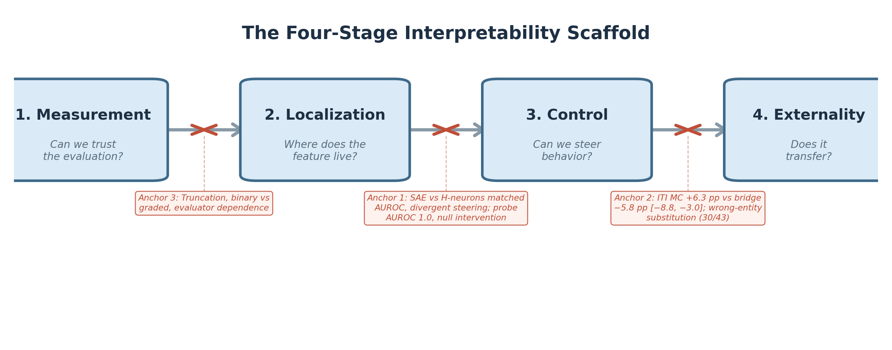

# 1. Introduction

A predictive internal signal -- a neuron, feature, or direction that reliably discriminates between behavioral categories on held-out data -- is a tempting steering target. If a feature predicts whether a language model will produce a hallucination, a harmful response, or a factually incorrect answer, it is natural to expect that amplifying or suppressing that feature will steer the model toward the desired behavior. This heuristic underlies much recent work in activation steering: identify a strong readout, then intervene through it (Li et al., 2023; Gao et al., 2025; Arditi et al., 2024).

The heuristic sometimes works. Refusal-mediating directions identified by simple difference-in-means produce reliable refusal modulation (Arditi et al., 2024). Hallucination-associated neurons selected by classification performance can shift over-compliance behavior (Gao et al., 2025). But the heuristic also sometimes fails, and the failure modes have received less systematic attention than the successes. When a strong readout fails as a steering target, is the problem in the readout, the intervention operator, the evaluation, or the generalization?

This paper tests the readout-to-steering heuristic empirically in Gemma-3-4B-IT. We compare multiple intervention families -- neuron scaling, sparse autoencoder feature steering, inference-time intervention via attention heads, and gradient-based causal head selection -- across contextual faithfulness, answer selection, open-ended factual generation, and jailbreak settings. We find repeated dissociations between four stages that are routinely conflated:

1. **Measurement** -- Can we trust the evaluation? Truncation artifacts, binary-versus-graded scoring, and evaluator choice each changed the scientific conclusion about whether an intervention worked; after the StrongREJECT GPT-4o rerun, the holdout binary-accuracy gap disappeared and the reason to prefer CSV-v3 became measurement granularity rather than binary superiority (§6).
2. **Localization** -- Does the readout identify causally relevant components? SAE features matched H-neurons on detection quality (AUROC 0.848 vs. 0.843), yet in the committed FaithEval comparison they did not translate into useful control while H-neurons did. Supporting JailbreakBench selector comparisons point in the same direction, but remain benchmark-local and caveated (§4).
3. **Control** -- Does intervention produce the intended behavioral change? When it did, the effect was narrow: H-neurons improved compliance on FaithEval but showed no robust net alias-accuracy effect on BioASQ despite substantial behavioral perturbation; ITI improved answer selection but not open-ended generation (§5).
4. **Externality** -- Does the effect transfer without causing harm? The TriviaQA bridge benchmark revealed that ITI does not merely degrade generation; it often substitutes nearby wrong entities for correct ones (§5.3).

The rest of the paper treats these as distinct empirical gates rather than one inferential leap. Sections 4--6 test each break directly, and Section 7 turns the case study into a practical audit framework and checklist.

Figure 1 shows the four-stage scaffold and places the paper's three anchor case studies at the stage transitions where the readout-to-steering heuristic breaks.

*Figure 1. The paper's three anchor case studies map onto failures at the measurement->conclusion, localization->control, and control->externality transitions.*

**Contributions.** (1) A matched FaithEval comparison showing that similar readout quality can yield sharply different steering outcomes. (2) An externality analysis showing that answer-selection gains do not transfer cleanly to open-ended factual generation, with wrong-entity substitution as the dominant observed failure mode. (3) A four-stage audit framework for evaluating mechanistic intervention claims without collapsing measurement, localization, control, and externality into one inference.
