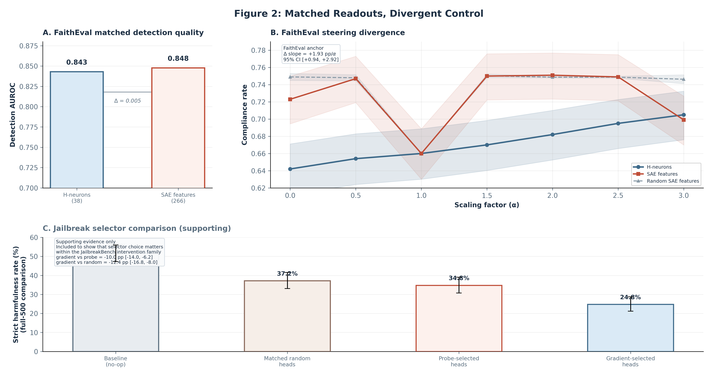

# 4. Case Study I: From Localization to Control

This section presents the paper's strongest localization-to-control evidence. Across two intervention families and two evaluation surfaces in Gemma-3-4B-IT, strong predictive readouts did not reliably identify useful steering targets. The anchor result is the matched FaithEval comparison between magnitude-ranked neurons and SAE features. The jailbreak selector results play a narrower corroborative role: they show that, within the same intervention family on JailbreakBench, different selection criteria can lead to different behavioral outcomes.

We therefore organize the section by evidential strength. Section 4.1 establishes that the readouts under study are genuine held-out signals, not strawmen. Section 4.2 presents the paper's cleanest single experiment: matched detection quality between magnitude-ranked neurons and SAE features, with sharply divergent steering outcomes. Section 4.3 keeps the matched jailbreak pilot as a limited selector contrast. Section 4.4 then uses the larger JailbreakBench panel more cautiously: it supports the same qualitative point, but the comparison is not fully like-for-like and therefore does not settle the selector question.

Figure 2 follows that hierarchy: Panels A and B carry the FaithEval result, while Panel C is included only to show that selector choice can matter within the JailbreakBench intervention family.

*Figure 2. Panels A and B anchor the section with the matched FaithEval neuron-versus-SAE comparison. Panel C is supporting evidence from JailbreakBench: it is included to show that selector choice can matter within the same intervention family, not to settle the selector question. The full-500 comparator remains caveated because the branches were not all scored under the same evaluation setup.*

## 4.1 The Readouts Are Real

The intervention targets examined below were selected through held-out predictive readouts that meet or exceed conventional standards. This matters because the subsequent null steering results are only informative if the underlying detection signal is genuine.

**Magnitude-ranked neurons.** A CETT probe (Gao et al., 2025) trained on FaithEval context-grounding activations identified 38 neurons (out of 348,160 total feed-forward neurons across 34 layers) with positive logistic regression weight at regularization strength $C = 1.0$. On a disjoint held-out split, this probe achieved AUROC $0.843$ (accuracy $76.5\%$, $n_{\text{test}} = 780$).[^fn-classifier-structure] The 38 neurons span 23 of 34 layers, with concentration in early layers (18 neurons, 47.4%, in layers 0--10).[^fn-classifier-structure]

**SAE features.** An L1 logistic regression probe trained on Gemma Scope 2 sparse autoencoder activations (16k-width SAEs across 10 layers) selected 266 positive-weight features at $C = 0.005$, achieving AUROC $0.848$ (accuracy $77.2\%$, $n_{\text{test}} = 782$).[^fn-classifier-sae] This marginally exceeds the CETT probe but falls within its bootstrap confidence interval $[0.815, 0.870]$ and uses $7\times$ more features.[^fn-sae-audit]

**Probe-ranked attention heads.** For the jailbreak intervention setting, a per-head AUROC probe trained on harmful/benign activation contrasts from JailbreakBench produced a top-20 head set where the two highest-ranked heads each achieved AUROC $1.0$ (balanced accuracy $1.0$ and $0.95$, respectively), and all 20 selected heads scored between $0.87$ and $1.0$.[^fn-probe-metadata]

**Interpretation caveats.** While the aggregate detection signal is robust, its interpretation at the individual-component level is less clear. The highest-weight neuron in the CETT probe (L20:N4288, weight $12.169$, contributing $30.7\%$ of top-10 weight mass) failed all six causal importance tests, is absent at $C \le 0.3$, appears at $C = 1.0$, and drops to rank 5 at $C = 3.0$, where a 219-neuron detector achieves $80.5\%$ accuracy.[^fn-classifier-structure] A verbosity confound analysis found that response length dominates truthfulness signal by a factor of $3.7$--$16\times$ in full-response readouts.[^fn-strat-assessment] These observations do not undermine the held-out AUROC values — which measure genuine discrimination — but they caution against interpreting probe weights as a guide to mechanistic importance. Appendix A summarizes the detector-interpretation audits that motivate this caution.

[^fn-classifier-structure]: `data/gemma3_4b/pipeline/classifier_structure_summary.json`; classifier: `models/gemma3_4b_classifier_disjoint.pkl`; test AUROC $= 0.8429$.
[^fn-classifier-sae]: `data/gemma3_4b/pipeline/classifier_sae_summary.json`; classifier: `models/sae_detector.pkl`; test AUROC $= 0.8477$, $n_{\text{positive}} = 266$ features across 10 layers.
[^fn-sae-audit]: `data/gemma3_4b/intervention/faitheval_sae/sae_pipeline_audit.md`, Finding 3.
[^fn-probe-metadata]: `data/contrastive/refusal/iti_refusal_probe_d7/extraction_metadata.json`; top-2 heads: L10:H6 (AUROC $1.0$, balanced accuracy $1.0$) and L2:H6 (AUROC $1.0$, balanced accuracy $0.95$).
[^fn-strat-assessment]: `data/gemma3_4b/intervention/verbosity_confound/verbosity_confound_audit.md`; summarized in Appendix A alongside the N4288 audit.

## 4.2 Magnitude-Ranked Neurons vs. SAE Features on FaithEval

This comparison is the paper's cleanest single experiment. Both methods achieve matched detection quality on the same benchmark, same model, and same behavioral construct (context-grounding compliance on FaithEval, $n = 1{,}000$). The comparison is matched on readout quality and evaluation surface, but the intervention families still differ in representational basis, operator form, auxiliary machinery, and layer coverage: neurons in the feed-forward network's down-projection input space versus features in a sparse autoencoder's latent space.

### Setup

**Magnitude-ranked neuron intervention.** The 38 CETT-selected neurons were scaled multiplicatively: at each forward pass, the activation of each selected neuron was multiplied by $\alpha \in \{0.0, 0.5, 1.0, 1.5, 2.0, 2.5, 3.0\}$, where $\alpha = 1.0$ is the identity (no-op). This intervention operates directly in the model's feed-forward computation, requiring no auxiliary encoding or decoding step.

**SAE feature intervention.** The 266 classifier-selected SAE features were scaled through an encode-modify-decode cycle: at each token position, activations were encoded through the Gemma Scope 2 SAE, target features were multiplied by $\alpha$, and the modified representation was decoded back to activation space. At $\alpha = 1.0$, the hook returned the original activation unchanged (early return, no encode/decode applied). This design follows the methodology described in Arad et al. (2025) for SAE-based behavioral steering.

**Evaluation.** Compliance was scored deterministically via regex-based letter extraction on FaithEval's multiple-choice format ($n = 1{,}000$ items). The primary metric was compliance rate (proportion of items where the model selected the misleading answer consistent with the provided context, against explicit instructions).

### Results

**Table 3 — FaithEval Compliance by Intervention Method and Scaling Factor**

| $\alpha$ | Neurons (38) | SAE H-features (266) | SAE random (mean $\pm$ SD, 3 seeds) |
|---|---|---|---|
| 0.0 | 64.2% [61.2, 67.1] | 72.3% [69.4, 75.0] | 74.9% $\pm$ 0.4 |
| 0.5 | 65.4% [62.4, 68.3] | 74.7% [71.9, 77.3] | 74.8% $\pm$ 0.4 |
| 1.0 | 66.0% [63.0, 68.9] | **66.0%** [63.0, 68.9] | **66.0%** $\pm$ 0.0 |
| 1.5 | 67.0% [64.0, 69.8] | 75.0% [72.2, 77.6] | 75.0% $\pm$ 0.2 |
| 2.0 | 68.2% [65.2, 71.0] | 75.1% [72.3, 77.7] | 74.9% $\pm$ 0.1 |
| 2.5 | 69.5% [66.6, 72.3] | 74.9% [72.1, 77.5] | 74.9% $\pm$ 0.1 |
| 3.0 | 70.5% [67.6, 73.2] | 69.9% [67.0, 72.7] | 74.6% $\pm$ 0.5 |

Wilson 95% CIs shown for neurons and SAE H-features ($n = 1{,}000$). $\alpha = 1.0$ is the no-op baseline for both intervention modes.[^fn-faitheval-results][^fn-sae-comparison]

**Neuron steering showed a significant, monotonic dose-response.** The magnitude-ranked neuron compliance slope was $+2.09$ pp/$\alpha$ $[1.38, 2.83]$ (paired bootstrap 95% CI, 10,000 resamples). The Spearman rank correlation between $\alpha$ and compliance rate was $\rho = 1.0$ (perfectly monotonic). Relative to the $\alpha = 1.0$ no-op baseline, compliance at $\alpha = 3.0$ increased by $+4.5$ pp $[2.9, 6.1]$. The full $\alpha = 0 \rightarrow 3$ sweep, which includes recovery from ablation at $\alpha = 0$, spans $+6.3$ pp $[4.2, 8.5]$.[^fn-faitheval-results]

**SAE feature steering was indistinguishable from zero.** The H-feature compliance slope was $+0.16$ pp/$\alpha$ $[-0.51, 0.84]$ — the confidence interval includes zero. The Spearman correlation was $\rho = 0.18$ (no monotonic trend). Random SAE features (266 features drawn from zero-weight classifier positions, 3 seeds) produced a mean slope of $+0.59$ pp/$\alpha$ $[0.54, 0.64]$.[^fn-sae-comparison]

**The slope difference confirms the divergence.** The neuron-minus-SAE slope difference was $+1.93$ pp/$\alpha$ $[+0.94, +2.92]$ (paired bootstrap 95% CI, 10,000 resamples, same 1,000 items; directional permutation $p < 0.001$, 4/50,000 permutations $\geq$ observed gap).[^fn-slope-diff] The confidence interval excludes zero, confirming that the neuron dose-response was significantly steeper than the SAE dose-response on the same evaluation surface. This paired slope-difference result is the paper's anchor reporting claim for the FaithEval neuron-versus-SAE comparison.[^fn-slope-diff]

The distinction between the two SAE null summaries matters for cross-document consistency. The main full-sweep result reported in this paper is the $+0.16$ pp/$\alpha$ null above; the $+0.12$ pp/$\alpha$ figure reported later refers to the delta-only control that removes reconstruction error as an explanation for the null.

**H-features performed worse than random features at $\alpha = 3.0$.** At the highest scaling factor, classifier-selected SAE features yielded $69.9\%$ compliance versus $74.6\%$ for random SAE features — a $-4.7$ pp difference in the wrong direction. If the 266 selected features encoded the compliance mechanism, amplifying them should have produced larger gains than amplifying random features. The reversal is consistent with over-amplification of compliance-correlated but causally irrelevant features disrupting the decode reconstruction.[^fn-sae-audit-finding2]

### The SAE Encode/Decode Cycle Is Not the Explanation

A natural objection is that the SAE's lossy reconstruction (relative L2 error $= 0.1557$) destroyed the steering signal. We tested this directly with a delta-only architecture that cancels reconstruction error exactly: $\mathbf{h}_t + \text{decode}(\mathbf{f}_{\text{modified}}) - \text{decode}(\mathbf{f}_{\text{original}})$, where only the targeted feature modifications propagate to the residual stream.[^fn-sae-delta]

The delta-only H-feature slope was $+0.12$ pp/$\alpha$, and the delta-only random slope was $-0.09$ pp/$\alpha$ — both indistinguishable from zero. The neuron baseline on the same three-alpha subset was $+2.12$ pp/$\alpha$. The delta-only architecture also eliminated the ${\sim}8$--$9$ pp compliance shift caused by lossy reconstruction (all non-identity alphas had produced elevated compliance regardless of feature selection under the full-replacement architecture) and reduced parse failures from $1.4$--$2.3\%$ to zero.[^fn-sae-delta]

This rules out reconstruction error as the primary confounder for the null in this setup. The direct result is narrower than a general statement about SAE features: this SAE configuration and encode-modify-decode operator did not translate matched readout quality into useful control on FaithEval. Feature-space misalignment remains a plausible interpretation, but the delta-only result is the relevant evidence for ruling out reconstruction noise rather than the paired slope-difference result itself.

### Neuron Specificity Is Confirmed by Negative Controls

To establish that the neuron dose-response reflects the specific identity of the 38 selected neurons rather than a generic perturbation effect, we ran two families of negative controls: 5 unconstrained random neuron sets (38 neurons each, drawn uniformly from all 348,160 feed-forward neurons) and 3 layer-matched random neuron sets (38 neurons with the same layer distribution as the CETT selection, drawn from non-selected neurons within those layers). In total, 8 independent random seeds were evaluated across the same alpha sweep.[^fn-faitheval-control]

All 8 random seeds produced null compliance slopes. The mean unconstrained-random slope was $+0.02$ pp/$\alpha$ $[-0.11, 0.16]$ (95% empirical percentile interval across 5 seeds), and the mean layer-matched slope was $+0.17$ pp/$\alpha$ $[0.15, 0.21]$. No random seed produced a monotonic dose-response. At $\alpha = 3.0$, the H-neuron compliance rate ($70.5\%$) exceeded the 95th percentile of the random distribution ($65.8$--$66.5\%$).[^fn-faitheval-control]

The H-neuron slope of $+2.09$ pp/$\alpha$ exceeds the maximum observed random slope ($+0.21$ pp/$\alpha$, layer-matched seed 0) by an order of magnitude. Paired bootstrap slope differences (neuron minus random, same 1,000 items) ranged from $+1.89$ to $+2.20$ pp/$\alpha$ across all 8 seeds, with every CI excluding zero and every permutation $p < 0.001$.[^fn-slope-diff-ctrl] The intervention effect is neuron-specific, not a property of generic 38-neuron perturbations at this scale.

### Summary

Detection quality was matched: AUROC $0.843$ (neurons) versus $0.848$ (SAE features). Steering diverged completely: $+2.09$ pp/$\alpha$ $[1.38, 2.83]$ versus $+0.16$ pp/$\alpha$ $[-0.51, 0.84]$; the paired slope difference was $+1.93$ pp/$\alpha$ $[+0.94, +2.92]$ (directional permutation $p < 0.001$). The narrow reporting claim is therefore strong: on matched FaithEval items, the committed H-neuron intervention produced a steeper compliance slope than the committed full-replacement SAE intervention. The broader causal interpretation still rests on the delta-only control ruling out reconstruction error as the primary confound, while the 8 random-neuron seeds establish neuron specificity. Matched readout quality did not predict matched intervention utility.

[^fn-faitheval-results]: `data/gemma3_4b/intervention/faitheval/experiment/results.json`; slope and delta CIs from paired bootstrap (10,000 resamples, seed 42).
[^fn-sae-comparison]: `data/gemma3_4b/intervention/faitheval_sae/control/comparison_summary.json`.
[^fn-sae-audit-finding2]: `data/gemma3_4b/intervention/faitheval_sae/sae_pipeline_audit.md`, Finding 2.
[^fn-sae-delta]: `data/gemma3_4b/intervention/faitheval_sae/sae_pipeline_audit.md`, Confound 1; data in `data/gemma3_4b/intervention/faitheval_sae_delta/`.
[^fn-faitheval-control]: `data/gemma3_4b/intervention/faitheval/control/comparison_summary.json`; 5 unconstrained seeds (slopes: $+0.17$, $-0.00$, $-0.07$, $-0.11$, $+0.11$ pp/$\alpha$) and 3 layer-matched seeds (slopes: $+0.21$, $+0.16$, $+0.15$ pp/$\alpha$).
[^fn-slope-diff]: Canonical audit: `notes/act3-reports/2026-04-13-faitheval-slope-difference-reporting-audit.md`; underlying paired summary: `data/gemma3_4b/intervention/faitheval_sae/control/slope_difference_summary.json` (paired bootstrap, 10,000 resamples, seed 42; directional permutation test, 50,000 permutations, seed 43).
[^fn-slope-diff-ctrl]: Canonical audit: `notes/act3-reports/2026-04-13-faitheval-slope-difference-reporting-audit.md`; underlying per-seed paired summaries: `data/gemma3_4b/intervention/faitheval/control/slope_difference_summary.json` (10,000 bootstrap resamples each, 50,000 permutations each).

## 4.3 Pilot Selector Contrast on Jailbreak

The FaithEval comparison in Section 4.2 is the paper's anchor localization result. This subsection adds a narrower selector-level comparison on jailbreak: on a matched pilot, probe-ranked heads with perfect readout quality were inert while a gradient-ranked selector was not.

### Setup

Both interventions operate at the attention-head level using Inference-Time Intervention (ITI; Li et al., 2023): a learned direction vector is added to the residual stream contribution of each selected head during decoding. The two methods differ only in how heads are ranked for selection.

**Probe-ranked selection.** Each of the model's 272 attention heads (34 layers $\times$ 8 heads) was scored by its held-out AUROC on a harmful/benign activation contrast derived from JailbreakBench prompts. The top-20 heads were selected for intervention. As reported in Section 4.1, the top two heads achieved AUROC $= 1.0$, and all 20 selected heads scored between $0.87$ and $1.0$.[^fn-probe-metadata]

**Gradient-ranked selection.** Each head was scored by the mean absolute gradient of the model's refusal probability with respect to a rank-1 approximation of the head's output, computed on the same harmful/benign contrast set. This is a causal criterion: it measures how much perturbing each head's output changes the model's tendency to refuse, rather than how well the head's activations predict the behavioral label.[^fn-causal-metadata]

**Evaluation.** Both selectors were tested at matched intervention strength ($k = 20$ heads). The cleanest selector-to-selector comparison comes from the pilot ($n = 100$), where both probe-ranked and gradient-ranked heads were swept across $\alpha \in \{0.0, 1.0, 2.0, 4.0, 8.0\}$ under the same evaluation procedure. The primary metric there was strict harmfulness rate: the proportion of responses judged as unambiguously harmful under CSV-v2 graded severity scoring (Bhalla et al., 2024).[^fn-d7-pilot] The newer full-500 jailbreak evidence is handled separately in Section 4.4 because the larger April 14 summary is informative but not fully like-for-like: legacy L1 and causal were reported in the April 8 audit, while probe and layer-matched random were later added in a normalized April 14 summary.[^fn-d7-full500]

### Results

**Probe-ranked heads: null at every alpha.** On the pilot, the best probe intervention produced a $-2$ pp change in strict harmfulness rate $[-10, +6]$ (paired bootstrap 95% CI, $n = 100$). At $\alpha = 8.0$, the probe intervention *increased* harmful compliance by $+6$ pp (from 30 to 36 strictly harmful responses, with $+12$ pp $[+3, +21]$ on binary judge compliance), accompanied by 82\% of responses hitting the 5,000-token generation cap — consistent with model degeneration rather than genuine behavioral change.[^fn-d7-pilot]

**Gradient-ranked heads: significant harm reduction on the matched pilot.** On the same pilot, the gradient-ranked selector at $\alpha = 4.0$ reduced strict harmfulness by $-13$ pp $[-21, -6]$ (paired bootstrap 95% CI, $n = 100$). This is the cleanest apples-to-apples selector result in this jailbreak comparison because both selectors were evaluated on the same sample, alpha grid, and ruler.[^fn-d7-pilot]

**The two selectors identified fundamentally different heads.** Jaccard similarity between the probe-ranked and gradient-ranked top-20 sets was $0.11$: only 4 heads overlapped out of 36 unique heads. The gradient-ranked selector concentrated in layer 5 (4 heads) and selected late-layer heads (layers 27--28), while the probe selector concentrated in layers 4 and 9 with high AUROC ($0.87$--$1.0$) but no gradient signal.[^fn-d7-pilot]

**Table 4 — Probe vs. Gradient Selector: Detection Quality and Steering Outcome**

| Property | Probe-ranked (top 20) | Gradient-ranked (top 20) |
|---|---|---|
| Ranking criterion | Per-head AUROC on harmful/benign contrast | Mean $|\nabla|$ of refusal probability w.r.t. head output |
| Detection quality (top heads) | AUROC $1.0$ / $1.0$ / $0.99$ / $0.98$ / $0.96$ | Not applicable (causal, not discriminative) |
| Best steering effect (pilot, $n=100$) | $-2$ pp $[-10, +6]$ (null) | $-13$ pp $[-21, -6]$ |
| Jaccard overlap with other selector | 0.11 (4/36 heads) | 0.11 (4/36 heads) |
| Head concentration | Layers 4, 9 | Layers 5, 27--28 |

### Interpretation

The probe-ranked heads discriminated harmful from benign activations perfectly on the pilot readout, yet perturbing them produced no clear behavioral change. The gradient-ranked heads were never assessed for discriminative quality, yet intervening on them reduced harmful compliance on the same pilot. This is useful corroboration for the paper's broader thesis, but it remains a limited pilot comparison rather than a headline jailbreak result.

The relevant lesson is narrow. On this benchmark and intervention family, components that read out a behavioral label need not be the components that move the label when perturbed. Probe-ranked heads may sit downstream of the decisive mechanism, while gradient-ranked heads were selected for causal influence. Section 4.4 explains why the newer full-500 comparator remains supporting evidence rather than a definitive answer.

[^fn-causal-metadata]: `data/contrastive/refusal/iti_refusal_causal_d7/extraction_metadata.json`; gradient computed as mean $|\partial p_{\text{refuse}} / \partial \mathbf{v}_{\text{head}}|$ over the harmful/benign contrast set.
[^fn-d7-pilot]: `notes/act3-reports/2026-04-07-d7-causal-pilot-audit.md`; probe results from pilot ($n = 100$), 5 alphas.
[^fn-d7-full500]: Canonical April 14 selector audit: `notes/act3-reports/2026-04-14-d7-full500-current-state-audit.md`; machine-readable summary: `data/gemma3_4b/intervention/jailbreak_d7/full500_canonical/d7_full500_current_state_summary.json`. Historical April 8 provenance remains in `notes/act3-reports/2026-04-08-d7-full500-audit.md`.

## 4.4 Full-500 Jailbreak Comparator as Supporting Evidence

The matched pilot in Section 4.3 remains the cleanest probe-versus-gradient comparison. The larger 500-prompt summary is useful for a narrower claim: in the available full-500 comparison, the gradient-ranked branch is the strongest completed branch. That reinforces the benchmark-specific point that selector choice can matter on JailbreakBench, but it does not establish that one selector is intrinsically better.

**Caveat 1: The full-500 comparison is not fully like-for-like.** The old April 8 caveat was that the random-head control was missing. That specific objection no longer applies: the April 14 audit includes both a layer-matched random-head seed and a completed full-500 probe branch. But the replacement is still not a clean selector comparison. The historical April 8 panel reported baseline $23.4\%$, L1 $27.4\%$, and causal $14.4\%$ strict harmfulness. The newer normalized April 14 summary reports baseline $51.6\%$, L1 $46.8\%$, random $37.2\%$, probe $34.8\%$, and causal $24.8\%$. On that panel, causal remains the strongest completed branch, beating probe by $10.0$ pp $[6.2, 14.0]$ and random by $12.4$ pp $[8.0, 16.8]$.[^fn-d7-full500] But because the branches were not all scored under the same evaluation setup, this remains supporting evidence rather than clean selector-specific proof.

**Caveat 2: Probe and random are now present at full scale, but both contain scoring errors.** The April 14 audit identified explicit graded-rubric span-validation errors in both added branches: 8 for the layer-matched random seed and 12 for the probe branch. Clean-row sensitivity analysis did not reverse the rank ordering, which is reassuring, but these are still not pristine evaluator outputs. The pilot comparison therefore remains the cleanest evidence that the AUROC-ranked selector can fail even when the intervention family itself is capable.[^fn-d7-pilot][^fn-d7-full500]

**Caveat 3: Model degeneration and scope limits remain visible.** At $\alpha = 4.0$, 112 of 500 gradient-ranked responses (22.4%) hit the 5,000-token generation cap, compared to 0% at baseline. The April 14 audit judged this more consistent with verbose refusal drift than with hidden harmfulness, but it is still an output-quality cost that must be reported alongside the safety gain.[^fn-d7-full500] And the gradient-ranked intervention remains specific to this benchmark: it has been tested only on JailbreakBench, not on other behavioral surfaces such as factual accuracy or instruction following.

**What the comparator does establish.** Despite these caveats, the jailbreak evidence still matters in two ways. First, it shows that the pilot probe-null is not an artifact of the ITI intervention family being incapable on this benchmark: the same intervention architecture, applied to different heads, can produce a substantially different outcome. Second, the low Jaccard overlap (0.11) between selectors shows that the ranking criteria surface genuinely different component sets.

For the purpose of this paper's thesis, the jailbreak selector result is supporting evidence that selector choice matters on this benchmark. We do not claim that gradient-based selection is universally superior, or that the available full-500 comparison settles the selector-specific question.

## 4.5 Synthesis

**Table 5 — Summary of Detection-Steering Dissociations**

| Comparison | Detection | Steering | Slope difference | Control evidence | Lesson |
|---|---|---|---|---|---|
| Neurons vs. SAE features (FaithEval) | AUROC $0.843$ vs. $0.848$ | $+2.09$ pp/$\alpha$ $[1.38, 2.83]$ vs. $+0.16$ pp/$\alpha$ $[-0.51, 0.84]$ | $+1.93$ pp/$\alpha$ $[+0.94, +2.92]$, $p < 0.001$ | 8-seed neuron null; delta-only SAE null | Matched detection, divergent steering |
| Probe vs. gradient heads (jailbreak) | AUROC ${\geq}0.92$ (top-20) vs. not assessed | Pilot: best probe $-2$ pp $[-10, +6]$ vs. causal $-13$ pp $[-21, -6]$; full-500 comparison: probe 34.8%, random 37.2%, causal 24.8%, baseline 51.6% | Not applicable (pilot matched; full-500 comparison not fully like-for-like)[^fn-asym] | Pilot probe comparison is clean; full-500 comparison is supportive but caveated | Perfect detection does not guarantee strong control |

Two patterns emerge from Table 5.

First, the anchor FaithEval comparison shows that detection quality did not predict steering success. The SAE probe matched the neuron probe on held-out AUROC and failed entirely on steering. The delta-only architecture ruled out reconstruction error as the primary explanation for that null.

Second, the jailbreak selector evidence points in the same qualitative direction but with narrower scope. On the matched pilot, probe-ranked heads achieved perfect discrimination and produced no clear intervention effect, while gradient-ranked heads did. In the larger full-500 comparison, the gradient-ranked branch remains strongest, but the results were not all scored under the same evaluation setup and therefore remain too caveated for a stronger selector-specific claim.

The positive counterexample is important: magnitude-ranked neurons *did* steer FaithEval compliance ($+4.5$ pp $[2.9, 6.1]$ above the no-op baseline at $\alpha = 3.0$; slope $+2.09$ pp/$\alpha$), with specificity confirmed against 8 random-neuron seeds. The thesis is not that detection-based targets never work. It is that detection quality alone is an unreliable heuristic for identifying when they will.

[^fn-asym]: The clean pilot selector comparison is matched within $n = 100$. The later full-500 comparison is not a formal paired slope-difference design because it combines historical and April 14 summaries scored under different evaluation setups. The inferential contrast therefore rests on one result being a clean pilot null and the later full-500 panel remaining directionally consistent but more caveated.
