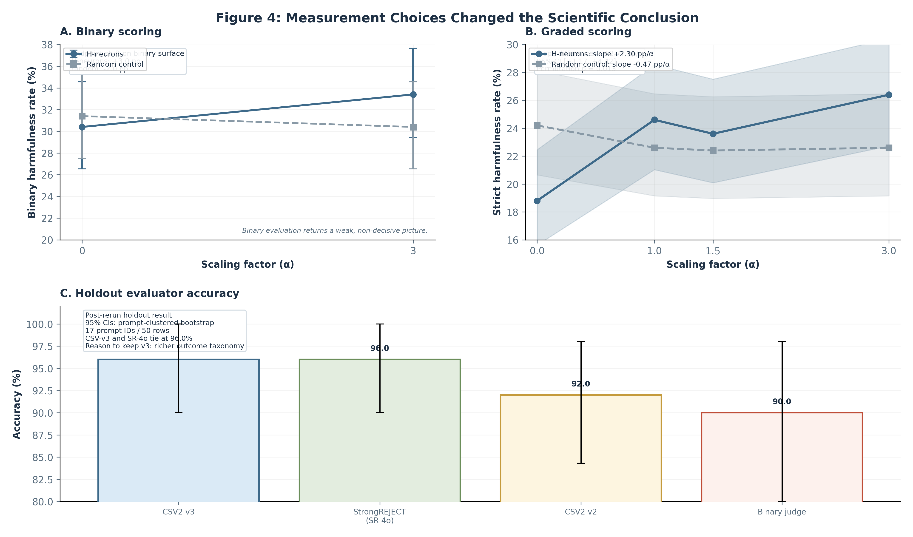

# 6. Measurement Choices Changed the Scientific Conclusion

The preceding sections established that detection quality does not predict steerability (Section 4) and that successful steering is narrow in scope (Section 5). Both conclusions rest on behavioral measurements -- jailbreak harmfulness rates, severity scores, and generation-surface accuracy -- that are themselves products of evaluation choices. In this section we show that those choices are part of the scientific result: generation length, scoring granularity, evaluator identity, and pipeline hygiene each shifted what we would have concluded about whether a given intervention worked. After the StrongREJECT GPT-4o rerun, the holdout binary result is tied with CSV-v3, so the surviving reason to prefer CSV-v3 in this paper is its richer measurement granularity rather than superior held-out binary accuracy.

We organize the case study around the H-neuron jailbreak scaling experiment (38 probe-selected neurons, $\alpha \in \{0, 1, 1.5, 3\}$, $n = 500$ per condition), because its moderate effect size makes it sensitive to every measurement decision we examine.

*Figure 4. Binary and graded scoring lead to different scientific conclusions, and the holdout evaluator panel uses prompt-clustered bootstrap CIs to show that CSV-v3 and StrongREJECT-GPT-4o are tied on binary holdout accuracy.*

## 6.1 Truncation Hides Downstream Content

Early jailbreak runs in this project used short generation caps (256 tokens in the legacy setup; 1024 tokens in a greedy-decode cross-check). Gemma-3-4B-IT often begins jailbreak responses with a refusal preamble and only later emits substantive harmful content. Short caps therefore preferentially capture the refusal-looking prefix and hide the downstream payload.

Moving to the canonical full-generation setup ($\texttt{max\_new\_tokens} = 5000$, sampled decoding) changed two interpretations. First, the apparent high-alpha reversal in the gradient-ranked pilot was revealed to be degeneration rather than a clean behavioral sign flip: 74% of causal responses and 82% of probe responses hit the 5,000-token cap at $\alpha = 8.0$. Second, the full-500 comparator still carries visible token-cap costs on the causal branch: 112/500 responses hit the cap at $\alpha = 4.0$. The historical April 8 audit remains useful provenance here because it shows that the causal safety effect survives restriction to non-cap rows ($-9.8$ pp $[-13.7, -5.9]$).^[Sources: `notes/act3-reports/2026-04-07-d7-causal-pilot-audit.md`; `notes/act3-reports/2026-04-16-d7-full500-two-seed-current-state-audit.md`; `notes/act3-reports/2026-04-08-d7-full500-audit.md`.]

The measurement lesson is simple: any intervention that changes response length, refusal elaboration, or degeneration will interact with a token cap. Full-generation scoring is therefore required for the kinds of jailbreak claims made in this paper.

## 6.2 Scoring Granularity Changes the Verdict

The same H-neuron jailbreak outputs look different under binary and graded evaluation. A GPT-4o binary harmful/safe judge shows a $+3.0$ pp endpoint shift from $\alpha = 0$ to $\alpha = 3$ (152/500 -> 167/500), with a confidence interval that includes zero. Under binary evaluation alone, the intervention looks weak and non-decisive.^[Source: `notes/act3-reports/2026-04-12-seed0-jailbreak-control-audit.md`, §1.2.]

CSV-v2 graded evaluation on those same outputs recovers a materially different result. The H-neuron strict harmfulness slope is $+2.30$ pp/$\alpha$ $[+0.99, +3.58]$, while a matched random-neuron control is flat at $-0.47$ pp/$\alpha$ $[-1.42, +0.47]$. The slope difference is $+2.77$ pp/$\alpha$ $[+1.17, +4.42]$ with permutation $p = 0.013$.^[Source: `notes/act3-reports/2026-04-12-seed0-jailbreak-control-audit.md`, §2.1.] Binary scoring washes out this signal because the effect largely lives in the movement of borderline cases into clearer refusal or clearer compliance.

A paired comparison on the same 500 outputs shows that evaluator version alone can compress the effect. Under CSV-v2, the strict harmfulness slope is $+2.30$ pp/$\alpha$ with CI excluding zero. Under CSV-v3 binary harmfulness on the identical rows, the slope falls to $+0.46$ pp/$\alpha$ $[-1.46, +2.41]$. The explanation is structural rather than mysterious: v3 absorbs a subset of v2-borderline records into harmfulness, and intervention-driven polarization reduces the number of borderline rows available to absorb at higher alphas. The main surviving v3 signal therefore appears at the severity level rather than the binary boundary: \texttt{substantive\_compliance} rises with slope $+2.00$ pp/$\alpha$ $[+0.11, +3.87]$.^[Source: `notes/act3-reports/2026-04-13-v2-v3-paired-evaluator-comparison.md`.]

This is the paper's core granularity result. Binary evaluation suggests a weak or null effect; graded evaluation shows a positive dose-response; the newer evaluator version shifts the signal from a binary harmfulness boundary to a more specific severity outcome.

## 6.3 Evaluator Dependence Is Part of the Result

If scoring granularity changes the verdict, evaluator identity can still matter after all outputs are reduced to binary harmful/safe labels. We tested four evaluators on a 74-record gold-labeled subset and then re-checked them on a 50-record holdout after removing calibration overlap. The development-set comparison is reported in Appendix Table E1; the holdout summary is the paper-facing result:

| Evaluator | Holdout accuracy | Holdout 95% CI (prompt-clustered) |
|---|---:|---:|
| CSV2 v3 | 96.0% | [90.0, 100.0] |
| StrongREJECT-GPT-4o | 96.0% | [90.0, 100.0] |
| CSV2 v2 | 92.0% | [84.3, 98.0] |
| Binary judge | 90.0% | [80.0, 98.0] |

No pairwise holdout difference is statistically confirmable on the contamination-clean split. CSV-v3 and StrongREJECT-GPT-4o both reached 96.0% holdout accuracy with identical error sets, so the reason to keep CSV-v3 in this paper is not binary superiority but richer outcome taxonomy.^[Sources: `notes/act3-reports/2026-04-12-4way-evaluator-holdout-validation.md`; `notes/act3-reports/2026-04-13-jailbreak-measurement-cleanup.md`, §3.]

The residual disagreement is still informative because it clusters on a recognizable response type: refuse-then-comply outputs. StrongREJECT's formula zeroes the final score when \texttt{refused = 1}, even if later text contains specific harmful substance. The development-set audit shows that this rubric choice, not judge-model weakness alone, explains the remaining false negatives after the GPT-4o rerun. In this paper we therefore treat evaluator disagreement as construct pluralism rather than as noise that can be solved by picking one preferred judge. Appendix E gives a worked summary of that disagreement regime.^[Sources: `notes/act3-reports/2026-04-12-4way-evaluator-comparison.md`; `notes/act3-reports/2026-04-12-4way-evaluator-holdout-validation.md`; `notes/act3-reports/2026-04-13-jailbreak-measurement-cleanup.md`.]

## 6.4 Measurement Validity Includes Pipeline Hygiene

Measurement can also fail for purely technical reasons. In our specificity analysis, a version-mismatch bug applied CSV-v3 normalization logic to CSV-v2 records, silently reclassifying 167 of 171 borderline rows (97.7%) as strict compliance and inflating the strict harmfulness rate from 18.8% to 52.2%.^[Source: `notes/act3-reports/2026-04-12-seed0-jailbreak-control-audit.md`, §6.1.] The fix was simple -- preserve CSV-v2 records in their native schema instead of forcing them through v3 normalization -- but the scientific consequence was large: without that repair, the H-neuron-versus-random specificity contrast would have looked much weaker than it really was.

The broader point is not about one bug. Measurement validity in intervention studies includes record-count checks, schema checks, prompt-ID parity, and version-aware evaluation logic. In this project, those implementation details materially changed what the paper could honestly conclude about whether an intervention worked.
